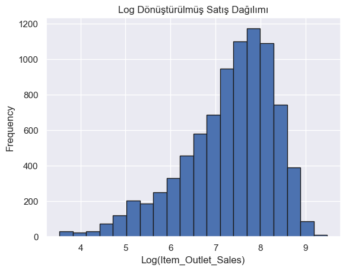
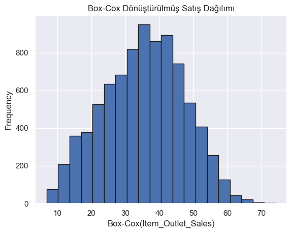
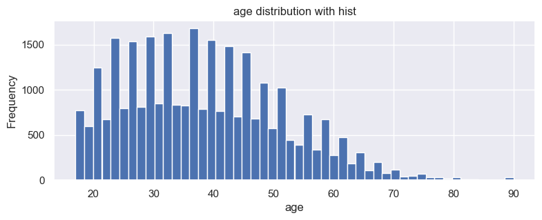

# BigMart Satış Tahmini ve İstatistiki Analizi
Göksel Bilici END513 Uygulama Projesi

## İçerik:
1. [Giriş](#giris)
2. [Problem Tanımı ve Çalışmanın Amacı](#problem_ve_amac)
3. [Veri Tanıma](#veri_tanıma)
4. [Önerilen Model](#model)
    - [Kavramlar, Değişkenler ve Ölçekleri](#kavramlar)
    - [Model (Şekil ve/veya Denklem) ve Temel Hipotezler](#hipotezler)
5. [Modeli Uygulama](#implementation)
    - [Eksik Verileri Doldurma](#veri_doldurma)
    - [Veriyi Görselleştirme ve Keşfetme](#visualization)
    - [Etiket Düzenlemesi ve Veri Manipülasyonu](#manipulation)
    - [STASTICAL ANALYSIS](#stats_analyze)
6. [Yöntem](#yontem)
   - [Çok Değişkenli İstatistiksel Analiz Yöntemleri ve Seçilme Nedenleri](#yontemler)
   - [Örnekleme Yaklaşımı ve Veri Toplama](#yaklasım)
   - [Verilerin Gözden Geçirilmesi](#veri_kontrol)
        - [Dışa Düşen Veriler (Kutu Diyagramı, Z dönüşümü, Uzaklık Ölçüleri vb.)](#dışavurum)
        - [Eksik Veriler ve Tamamlanması (EM, MAR, MCAR, NMAR vb. yaklaşımlar)](#eksikler)
   - [Varsayımların Gözden Geçirilmesi](#varsayım_kontrol)
        - [Normal Dağılıma Uygunluk (KS Testi, JB Testi, Shapiro-Wilks Testi, Q-Q Plot, vb.)](#normal_uygunluk)
        - [Normallik için Dönüştürme (gerekli olması durumunda; Ör. Box-Cox)](#normal_dönüşümler)
        - [Yöntemlere Özel Diğer Varsayımlar](#özel_varsayımlar)
7. [Analizler](#analizler)
8. [Bulgular ve Değerlendirme](#bulgular)
9. [Sonuç ve Öneriler](#sonuc)
10. [Kaynaklar](#kaynak)
11. [Ekler](#ekler)
12. [Geliştirilmiş İlk Proje - İlk Çalışma](#ilkproje)

<a id = "giris"></a>
## 1. Giriş

Bu projede başlangıçta, bireylerin gelir seviyelerini tahmin etmeye yönelik bir analiz gerçekleştirilmesi planlanmıştır. Bankacılık sektöründe gelir bilgisi, kredi değerlendirme, işbirliği fırsatlarını analiz etme ve yatırım kararları gibi birçok alanda hayati öneme sahiptir. Gelir düzeylerinin doğru bir şekilde tahmini, finansal risk yönetimi ve karar destek sistemlerinin etkinliğini artırma potansiyeline sahiptir. Ancak, veri gizliliği ve Kişisel Verilerin Korunması Kanunu (KVKK) gibi yasal düzenlemeler nedeniyle, ideal veri kaynaklarına erişim sınırlıdır. Bu sebeple, analiz için Amerika Birleşik Devletleri'ndeki yetişkin bireylere ait açık bir veri seti tercih edilmişti.

Başlangıç analizlerinde, bu veri seti üzerinden kapsamlı istatistiksel değerlendirmeler yapılmış ve gelir tahmini için etkili bir model geliştirilmesi hedeflenmiştir. Ancak, veri setindeki değişkenlerin çoğunlukla kategorik olması ve beklenen sonuçlarla uyumsuzluk göstermesi nedeniyle, bu yaklaşımdan vazgeçilmiştir.

Güncel durumda ise proje, BigMart tarafından 2013 yılında 10 farklı şehirdeki 1559 ürün ve mağaza satışlarına dair toplanan veriler üzerine odaklanmaktadır. Veri seti, her ürün ve mağazaya ait belirli özellikleri içermektedir. Projenin temel amacı, belirli bir mağazada satılan her bir ürünün satışlarını tahmin edebilecek bir model geliştirmek ve bu model üzerinden ürün ve mağaza özelliklerinin satışları artırmada nasıl bir etki yarattığını anlamaktır. Ayrıca, veri setinde bazı mağazalardan eksik veri içerdiği görülmüştür. Bu eksikliklerin teknik aksaklıklardan kaynaklandığı düşünülmekte olup, bu durumun uygun veri işleme yöntemleriyle ele alınması gerekmektedir.

Projenin genel perspektifi, sadece nihai model geliştirmeyi değil, bu süreci destekleyecek kapsamlı istatistiksel analizler yapmayı ve farklı veri işleme tekniklerini uygulamayı da içermektedir.

<a id = "problem_ve_amac"></a>
## 2. Problem Tanımı ve Çalışmanın Amacı
BigMart, mağazalarındaki satış performansını artırmak ve ürünler ile mağaza özelliklerinin satışlar üzerindeki etkilerini daha iyi anlamayı hedeflemektedir. Farklı şehirlerdeki mağazalar arasında satış dinamikleri, ürün özellikleri ve müşteri tercihleri açısından karmaşık ilişkilerin bulunması, mağaza yönetimi ve strateji geliştirme süreçlerini zorlaştırmaktadır. Ayrıca, veri setinde bazı mağazalara ait eksik verilerin bulunması, analiz süreçlerini ve tahmin doğruluğunu olumsuz etkileyen bir başka önemli faktördür.

Bu bağlamda çalışmanın amacı, belirli bir mağazada satılan her bir ürünün satışlarını tahmin edebilecek bir makine öğrenimi modeli geliştirmektir. Geliştirilecek model, ürün ve mağaza özelliklerini dikkate alarak satış tahminleri yapacak ve BigMart’ın satış stratejilerini optimize etmesine yardımcı olacaktır. Model geliştirme sürecinde eksik veriler uygun yöntemlerle işlenecek, böylece eksik verilerin analiz ve tahmin süreçlerine olumsuz etkisi en aza indirgenecektir.

Çalışma, şu temel hedefler etrafında şekillenecektir:

Satış tahminlerini etkileyen ürün ve mağaza özelliklerini belirlemek.
Eksik verilerin etkilerini gidermek için uygun istatistiksel ve makine öğrenimi yöntemlerini uygulamak.
Geliştirilen modelin performansını değerlendirmek ve optimize etmek.
BigMart’ın ürün yönetimi ve satış stratejilerini daha etkili bir şekilde yönetmesine katkı sağlamak.
Sonuç olarak, bu proje, hem teorik hem de uygulamalı bir yaklaşımla BigMart'ın satış performansını etkileyen temel faktörleri analiz ederek, satış tahminlerine dayalı stratejik karar süreçlerini güçlendirmeyi hedeflemektedir;

### Değişkenlerin Açıklanması
Aşağıda, veri setindeki değişkenler ve bu değişkenlerin çalışmaya olan katkıları detaylandırılmıştır:

- Item_Identifier: Ürün kimliği. Her bir ürüne atanan benzersiz bir kimlik numarasıdır. Veri takibi ve gruplama için kullanılır.
- Item_Weight: Ürünün ağırlığı. Ağırlık, bazı ürün kategorilerinde satış performansını etkileyebilecek önemli bir faktördür.
- Item_Fat_Content: Ürünün düşük yağlı olup olmadığını belirten değişken. Ürünün besin içeriği, tüketici tercihlerini etkileyebilir.
- Item_Visibility: Ürünün bir mağazadaki toplam sergileme alanının yüzdesi. Ürünlerin görünürlüğü, satış performansı üzerinde doğrudan bir etkiye sahip olabilir.
- Item_Type: Ürünün kategorisi. Ürünlerin hangi gruba ait olduğunu belirler; farklı kategoriler farklı satış dinamiklerine sahip olabilir.
- Item_MRP: Ürünün maksimum perakende satış fiyatı (liste fiyatı). Ürün fiyatlandırması, tüketici davranışlarını ve satışları önemli ölçüde etkileyebilir.
- Outlet_Identifier: Mağaza kimliği. Her bir mağaza için benzersiz bir kimlik numarasıdır ve mağaza bazlı analizler için kullanılır.
- Outlet_Establishment_Year: Mağazanın kuruluş yılı. Mağazanın yaşı, müşteri kitlesi ve satış performansını etkileyebilir.
- Outlet_Size: Mağazanın fiziksel büyüklüğü (zemin alanı). Mağaza boyutu, ürün çeşitliliği ve müşteri çekim gücünü etkileyen bir faktördür.
- Outlet_Location_Type: Mağazanın bulunduğu şehir türü (küçük, orta veya büyük şehir). Şehir tipi, müşteri demografisi ve satın alma davranışlarını etkileyebilir.
- Outlet_Type: Mağazanın türü (bakkal, süpermarket vb.). Mağaza türü, ürün çeşitliliği ve satış stratejileri üzerinde belirleyici bir rol oynar.
- Item_Outlet_Sales: Belirli bir mağazada bir ürünün satış miktarı. Bu, modelin bağımlı değişkenidir ve tahmin edilmesi amaçlanan sonuç değişkenidir.

Bu değişkenler, ürün ve mağaza özellikleri ile satış ilişkisini analiz etmek ve daha iyi satış tahminleri yapmak için kritik bir rol oynamaktadır.


```python
import warnings
import numpy as np
import pandas as pd
import seaborn as sns
from sklearn import metrics
import matplotlib.pyplot as plt
from xgboost import XGBRegressor
from pandas.api.types import is_numeric_dtype
from sklearn.preprocessing import LabelEncoder
from sklearn.model_selection import train_test_split
```


```python
warnings.filterwarnings('ignore')
```

#### Veri Yükleme ve Keşfetme & Tanıma


```python
data = pd.read_csv('bmsf_train.csv')
```


```python
data.head()
```


<div>
<style scoped>
    .dataframe tbody tr th:only-of-type {
        vertical-align: middle;
    }

    .dataframe tbody tr th {
        vertical-align: top;
    }

    .dataframe thead th {
        text-align: right;
    }
</style>
<table border="1" class="dataframe">
  <thead>
    <tr style="text-align: right;">
      <th></th>
      <th>Item_Identifier</th>
      <th>Item_Weight</th>
      <th>Item_Fat_Content</th>
      <th>Item_Visibility</th>
      <th>Item_Type</th>
      <th>Item_MRP</th>
      <th>Outlet_Identifier</th>
      <th>Outlet_Establishment_Year</th>
      <th>Outlet_Size</th>
      <th>Outlet_Location_Type</th>
      <th>Outlet_Type</th>
      <th>Item_Outlet_Sales</th>
    </tr>
  </thead>
  <tbody>
    <tr>
      <th>0</th>
      <td>FDA15</td>
      <td>9.30</td>
      <td>Low Fat</td>
      <td>0.016047</td>
      <td>Dairy</td>
      <td>249.8092</td>
      <td>OUT049</td>
      <td>1999</td>
      <td>Medium</td>
      <td>Tier 1</td>
      <td>Supermarket Type1</td>
      <td>3735.1380</td>
    </tr>
    <tr>
      <th>1</th>
      <td>DRC01</td>
      <td>5.92</td>
      <td>Regular</td>
      <td>0.019278</td>
      <td>Soft Drinks</td>
      <td>48.2692</td>
      <td>OUT018</td>
      <td>2009</td>
      <td>Medium</td>
      <td>Tier 3</td>
      <td>Supermarket Type2</td>
      <td>443.4228</td>
    </tr>
    <tr>
      <th>2</th>
      <td>FDN15</td>
      <td>17.50</td>
      <td>Low Fat</td>
      <td>0.016760</td>
      <td>Meat</td>
      <td>141.6180</td>
      <td>OUT049</td>
      <td>1999</td>
      <td>Medium</td>
      <td>Tier 1</td>
      <td>Supermarket Type1</td>
      <td>2097.2700</td>
    </tr>
    <tr>
      <th>3</th>
      <td>FDX07</td>
      <td>19.20</td>
      <td>Regular</td>
      <td>0.000000</td>
      <td>Fruits and Vegetables</td>
      <td>182.0950</td>
      <td>OUT010</td>
      <td>1998</td>
      <td>NaN</td>
      <td>Tier 3</td>
      <td>Grocery Store</td>
      <td>732.3800</td>
    </tr>
    <tr>
      <th>4</th>
      <td>NCD19</td>
      <td>8.93</td>
      <td>Low Fat</td>
      <td>0.000000</td>
      <td>Household</td>
      <td>53.8614</td>
      <td>OUT013</td>
      <td>1987</td>
      <td>High</td>
      <td>Tier 3</td>
      <td>Supermarket Type1</td>
      <td>994.7052</td>
    </tr>
  </tbody>
</table>
</div>


```python
data.shape
```


    (8522, 12)


```python
data.info()
```

    <class 'pandas.core.frame.DataFrame'>
    RangeIndex: 8522 entries, 0 to 8521
    Data columns (total 12 columns):
     #   Column                     Non-Null Count  Dtype  
    ---  ------                     --------------  -----  
     0   Item_Identifier            8522 non-null   object 
     1   Item_Weight                7059 non-null   float64
     2   Item_Fat_Content           8522 non-null   object 
     3   Item_Visibility            8522 non-null   float64
     4   Item_Type                  8522 non-null   object 
     5   Item_MRP                   8522 non-null   float64
     6   Outlet_Identifier          8522 non-null   object 
     7   Outlet_Establishment_Year  8522 non-null   int64  
     8   Outlet_Size                6112 non-null   object 
     9   Outlet_Location_Type       8522 non-null   object 
     10  Outlet_Type                8522 non-null   object 
     11  Item_Outlet_Sales          8522 non-null   float64
    dtypes: float64(4), int64(1), object(7)
    memory usage: 799.1+ KB
    


```python
data.isnull().sum()
```


    Item_Identifier                 0
    Item_Weight                  1463
    Item_Fat_Content                0
    Item_Visibility                 0
    Item_Type                       0
    Item_MRP                        0
    Outlet_Identifier               0
    Outlet_Establishment_Year       0
    Outlet_Size                  2410
    Outlet_Location_Type            0
    Outlet_Type                     0
    Item_Outlet_Sales               0
    dtype: int64


```python
data.isna().sum() / data.shape[0] * 100
```


    Item_Identifier               0.000000
    Item_Weight                  17.167332
    Item_Fat_Content              0.000000
    Item_Visibility               0.000000
    Item_Type                     0.000000
    Item_MRP                      0.000000
    Outlet_Identifier             0.000000
    Outlet_Establishment_Year     0.000000
    Outlet_Size                  28.279747
    Outlet_Location_Type          0.000000
    Outlet_Type                   0.000000
    Item_Outlet_Sales             0.000000
    dtype: float64


```python
data.duplicated().sum()
```


    np.int64(0)


<a id = "veri_tanıma"></a>
## 3. Veri Tanıma


```python
# package imports
import warnings
import numpy as np
import pandas as pd
import seaborn as sns
import statsmodels.api as sm
from scipy.stats import zscore
from scipy.stats import boxcox
import matplotlib.pyplot as pltt
from scipy.stats import levene, bartlett
from scipy.stats import kstest, shapiro, jarque_bera
from sklearn.model_selection import train_test_split
from sklearn.metrics import mean_squared_error, mean_absolute_error
```


```python
# muhtemel uyarıalrı görmesek de olur
warnings.filterwarnings('ignore')
```


```python
# Verimizi çekelim
data = pd.read_csv('bmsf_train.csv')
```


```python
data.head(3)
```


<div>
<style scoped>
    .dataframe tbody tr th:only-of-type {
        vertical-align: middle;
    }

    .dataframe tbody tr th {
        vertical-align: top;
    }

    .dataframe thead th {
        text-align: right;
    }
</style>
<table border="1" class="dataframe">
  <thead>
    <tr style="text-align: right;">
      <th></th>
      <th>Item_Identifier</th>
      <th>Item_Weight</th>
      <th>Item_Fat_Content</th>
      <th>Item_Visibility</th>
      <th>Item_Type</th>
      <th>Item_MRP</th>
      <th>Outlet_Identifier</th>
      <th>Outlet_Establishment_Year</th>
      <th>Outlet_Size</th>
      <th>Outlet_Location_Type</th>
      <th>Outlet_Type</th>
      <th>Item_Outlet_Sales</th>
    </tr>
  </thead>
  <tbody>
    <tr>
      <th>0</th>
      <td>FDA15</td>
      <td>9.30</td>
      <td>Low Fat</td>
      <td>0.016047</td>
      <td>Dairy</td>
      <td>249.8092</td>
      <td>OUT049</td>
      <td>1999</td>
      <td>Medium</td>
      <td>Tier 1</td>
      <td>Supermarket Type1</td>
      <td>3735.1380</td>
    </tr>
    <tr>
      <th>1</th>
      <td>DRC01</td>
      <td>5.92</td>
      <td>Regular</td>
      <td>0.019278</td>
      <td>Soft Drinks</td>
      <td>48.2692</td>
      <td>OUT018</td>
      <td>2009</td>
      <td>Medium</td>
      <td>Tier 3</td>
      <td>Supermarket Type2</td>
      <td>443.4228</td>
    </tr>
    <tr>
      <th>2</th>
      <td>FDN15</td>
      <td>17.50</td>
      <td>Low Fat</td>
      <td>0.016760</td>
      <td>Meat</td>
      <td>141.6180</td>
      <td>OUT049</td>
      <td>1999</td>
      <td>Medium</td>
      <td>Tier 1</td>
      <td>Supermarket Type1</td>
      <td>2097.2700</td>
    </tr>
  </tbody>
</table>
</div>


```python
data.shape
```


    (8522, 12)


```python
data.info()
```

    <class 'pandas.core.frame.DataFrame'>
    RangeIndex: 8522 entries, 0 to 8521
    Data columns (total 12 columns):
     #   Column                     Non-Null Count  Dtype  
    ---  ------                     --------------  -----  
     0   Item_Identifier            8522 non-null   object 
     1   Item_Weight                7059 non-null   float64
     2   Item_Fat_Content           8522 non-null   object 
     3   Item_Visibility            8522 non-null   float64
     4   Item_Type                  8522 non-null   object 
     5   Item_MRP                   8522 non-null   float64
     6   Outlet_Identifier          8522 non-null   object 
     7   Outlet_Establishment_Year  8522 non-null   int64  
     8   Outlet_Size                6112 non-null   object 
     9   Outlet_Location_Type       8522 non-null   object 
     10  Outlet_Type                8522 non-null   object 
     11  Item_Outlet_Sales          8522 non-null   float64
    dtypes: float64(4), int64(1), object(7)
    memory usage: 799.1+ KB
    


```python
# Check Specific variable types (not object)
for col in data.columns:
    col_type = data[col].dtype
    if col_type == np.int64:  # Or np.int32, etc. depending on your data
        print(f"Column '{col}': int")
    elif col_type == object: # object type can be string or mixed type
        try:
            pd.to_numeric(data[col])
            print(f"Column '{col}': numeric string")
        except ValueError:
            print(f"Column '{col}': str") # If not numeric then it's string.
    elif col_type == np.float64: # Or np.float32
        print(f"Column '{col}': float")
    elif col_type == bool:
        print(f"Column '{col}': bool")
    elif pd.api.types.is_datetime64_any_dtype(col_type):
      print(f"Column '{col}': datetime")
    else:
        print(f"Column '{col}': {col_type}") # Other types
```

    Column 'Item_Identifier': str
    Column 'Item_Weight': float
    Column 'Item_Fat_Content': str
    Column 'Item_Visibility': float
    Column 'Item_Type': str
    Column 'Item_MRP': float
    Column 'Outlet_Identifier': str
    Column 'Outlet_Establishment_Year': int
    Column 'Outlet_Size': str
    Column 'Outlet_Location_Type': str
    Column 'Outlet_Type': str
    Column 'Item_Outlet_Sales': float
    


```python
data.describe().T
```


<div>
<style scoped>
    .dataframe tbody tr th:only-of-type {
        vertical-align: middle;
    }

    .dataframe tbody tr th {
        vertical-align: top;
    }

    .dataframe thead th {
        text-align: right;
    }
</style>
<table border="1" class="dataframe">
  <thead>
    <tr style="text-align: right;">
      <th></th>
      <th>count</th>
      <th>mean</th>
      <th>std</th>
      <th>min</th>
      <th>25%</th>
      <th>50%</th>
      <th>75%</th>
      <th>max</th>
    </tr>
  </thead>
  <tbody>
    <tr>
      <th>Item_Weight</th>
      <td>7059.0</td>
      <td>12.857370</td>
      <td>4.643728</td>
      <td>4.555</td>
      <td>8.772500</td>
      <td>12.600000</td>
      <td>16.850000</td>
      <td>21.350000</td>
    </tr>
    <tr>
      <th>Item_Visibility</th>
      <td>8522.0</td>
      <td>0.066135</td>
      <td>0.051600</td>
      <td>0.000</td>
      <td>0.026988</td>
      <td>0.053935</td>
      <td>0.094594</td>
      <td>0.328391</td>
    </tr>
    <tr>
      <th>Item_MRP</th>
      <td>8522.0</td>
      <td>141.000471</td>
      <td>62.274675</td>
      <td>31.290</td>
      <td>93.844250</td>
      <td>143.014100</td>
      <td>185.652250</td>
      <td>266.888400</td>
    </tr>
    <tr>
      <th>Outlet_Establishment_Year</th>
      <td>8522.0</td>
      <td>1997.831964</td>
      <td>8.372247</td>
      <td>1985.000</td>
      <td>1987.000000</td>
      <td>1999.000000</td>
      <td>2004.000000</td>
      <td>2009.000000</td>
    </tr>
    <tr>
      <th>Item_Outlet_Sales</th>
      <td>8522.0</td>
      <td>2181.455027</td>
      <td>1706.530835</td>
      <td>33.290</td>
      <td>834.913200</td>
      <td>1794.331000</td>
      <td>3101.296400</td>
      <td>13086.964800</td>
    </tr>
  </tbody>
</table>
</div>


```python
data.isnull().sum()
```


    Item_Identifier                 0
    Item_Weight                  1463
    Item_Fat_Content                0
    Item_Visibility                 0
    Item_Type                       0
    Item_MRP                        0
    Outlet_Identifier               0
    Outlet_Establishment_Year       0
    Outlet_Size                  2410
    Outlet_Location_Type            0
    Outlet_Type                     0
    Item_Outlet_Sales               0
    dtype: int64


```python
data.duplicated().sum()
```


    np.int64(0)


<a id = "model"></a>
## 4. Önerilen Model
Bu çalışmada, BigMart tarafından 2013 yılına ait 1559 ürün ve 10 mağazada toplanan satış verileri analiz edilecektir. Veri seti, ürün ve mağaza özelliklerini içeren çeşitli değişkenlerden oluşmaktadır. Amaç, her bir mağazada satılan ürünlerin satışlarını tahmin etmek ve bu süreçte ürün ve mağaza özelliklerinin satışlar üzerindeki etkilerini anlamaktır. Sonrasında yapılacak işlemlerle de bu perspektiften analiz etmektir.

<a id = "kavramlar"></a>
### Kavramlar, Değişkenler ve Ölçekleri
Aşağıda, çalışmada kullanılan değişkenler, türleri ve ölçüm ölçekleri verilmiştir. Veri setinde, ürünlere ve mağazalara ait çeşitli özellikler yer almakta ve Item_Outlet_Sales bağımlı değişken olarak tanımlanmaktadır.

| Değişken Adı             | Veri Türü       | Ölçüm Ölçeği       | Açıklama                                                                                     |
|--------------------------|-----------------|--------------------|---------------------------------------------------------------------------------------------|
| Item_Identifier          | String          | Nominal           | Ürün kimliği, her ürün için benzersiz bir değer.                                            |
| Item_Weight              | Float           | Oran (Ratio)      | Ürünün ağırlığı (kilogram cinsinden).                                                       |
| Item_Fat_Content         | String          | Nominal           | Ürünün yağ içeriği bilgisi (Low Fat, Regular vb.).                                          |
| Item_Visibility          | Float           | Oran (Ratio)      | Ürünün mağaza içinde görünürlüğü, toplam alanın yüzdesi olarak ifade edilir (0-1 arası).    |
| Item_Type                | String          | Nominal           | Ürünün kategorisi (Bakery, Dairy vb.).                                                     |
| Item_MRP                 | Float           | Oran (Ratio)      | Ürünün maksimum perakende satış fiyatı (list price).                                        |
| Outlet_Identifier        | String          | Nominal           | Mağaza kimliği, her mağaza için benzersiz bir değer.                                        |
| Outlet_Establishment_Year| Integer         | Oran (Ratio)      | Mağazanın kuruluş yılı.                                                                     |
| Outlet_Size              | String          | Nominal           | Mağaza boyutu (Small, Medium, Large).                                                      |
| Outlet_Location_Type     | String          | Nominal           | Mağazanın bulunduğu yerin türü (Urban, Suburban vb.).                                       |
| Outlet_Type              | String          | Nominal           | Mağaza türü (Grocery Store, Supermarket vb.).                                              |
| Item_Outlet_Sales        | Float           | Oran (Ratio)      | Ürünlerin mağaza başına satış geliri (bağımlı değişken).                                    |


<a id = "hipotezler"></a>
### Model (Şekil ve/veya Denklem) ve Temel Hipotezler

#### 1. Çoklu Regresyon Analizi

**Amaç:**  
Belirli bir mağazada satılan ürünlerin satışlarını (**Item_Outlet_Sales**) etkileyen faktörleri belirlemek. Bu analizde, bağımlı değişken **Item_Outlet_Sales** olup, bağımsız değişkenler şunlardır:  
- **Item_Weight**
- **Item_Fat_Content**
- **Item_Visibility**
- **Item_Type**
- **Item_MRP**
- **Outlet_Size**
- **Outlet_Location_Type**
- **Outlet_Type**

**Model Denklem (Regresyon):**
\[
Y = \beta_0 + \beta_1 X_1 + \beta_2 X_2 + \dots + \beta_n X_n + \epsilon
\]
- **Y:** Bağımlı değişken, **Item_Outlet_Sales**  
- **X_n:** Bağımsız değişkenler  
- **\beta_n:** Bağımsız değişkenlerin katsayıları  
- **\epsilon:** Hata terimi  

**Temel Hipotezler:**
- **Null Hipotez (H_0):** Bağımsız değişkenlerin satışlar üzerinde anlamlı bir etkisi yoktur (\(\beta_i = 0\)).  
- **Alternatif Hipotez (H_a):** Bağımsız değişkenlerin satışlar üzerinde anlamlı bir etkisi vardır (\(\beta_i \neq 0\)).


#### 2. İki Yönlü Varyans Analizi (Two-Way ANOVA)

**Amaç:**  
Mağaza türü (**Outlet_Type**) ve mağaza boyutunun (**Outlet_Size**) satışlar üzerindeki etkisini ve bu iki faktörün etkileşimlerini değerlendirmek.

**Hipotezler:**
1. **Faktör 1: Outlet_Type**
   - **Null Hipotez (H_0):** Mağaza türleri arasında satışlar açısından anlamlı bir fark yoktur.  
   - **Alternatif Hipotez (H_a):** Mağaza türleri arasında satışlar açısından anlamlı bir fark vardır.  
2. **Faktör 2: Outlet_Size**
   - **Null Hipotez (H_0)):** Mağaza boyutları arasında satışlar açısından anlamlı bir fark yoktur.  
   - **Alternatif Hipotez (H_a):** Mağaza boyutları arasında satışlar açısından anlamlı bir fark vardır.  
3. **Faktörlerin Etkileşimi (Interaction):**
   - **Null Hipotez (H_0):** Mağaza türü ve boyutu arasında etkileşim yoktur.  
   - **Alternatif Hipotez (H_a):** Mağaza türü ve boyutu arasında etkileşim vardır.  


<a id = "implementation"></a>
## 5. Model Modeli Uygulama
_Direk uygulama_

<a id = "veri_doldurma"></a>
### Eksik Verileri Doldurma
Genelde sürekli verileri ortalama ile, kategorik verileri mod ile doldurmak daha mantıklı
- Ortalama <= Sürekli Item_Weight
- Mod <= Kategorik Outlet_Size


```python
data['Item_Weight'].fillna(data['Item_Weight'].mean(), inplace=True)
```


```python
data.isnull().sum()
```


    Item_Identifier                 0
    Item_Weight                     0
    Item_Fat_Content                0
    Item_Visibility                 0
    Item_Type                       0
    Item_MRP                        0
    Outlet_Identifier               0
    Outlet_Establishment_Year       0
    Outlet_Size                  2410
    Outlet_Location_Type            0
    Outlet_Type                     0
    Item_Outlet_Sales               0
    dtype: int64


```python
data['Outlet_Size'].unique()
```


    array(['Medium', nan, 'High', 'Small'], dtype=object)


```python
data['Outlet_Size'].mode()
```


    0    Medium
    Name: Outlet_Size, dtype: object


```python
data['Outlet_Type'].unique()
```


    array(['Supermarket Type1', 'Supermarket Type2', 'Grocery Store',
           'Supermarket Type3'], dtype=object)


```python
mode_of_outlet_size = data.pivot_table(
    values='Outlet_Size',
    columns = 'Outlet_Type',
    aggfunc = lambda x : x.mode()[0]
)

mode_of_outlet_size
```


<div>
<style scoped>
    .dataframe tbody tr th:only-of-type {
        vertical-align: middle;
    }

    .dataframe tbody tr th {
        vertical-align: top;
    }

    .dataframe thead th {
        text-align: right;
    }
</style>
<table border="1" class="dataframe">
  <thead>
    <tr style="text-align: right;">
      <th>Outlet_Type</th>
      <th>Grocery Store</th>
      <th>Supermarket Type1</th>
      <th>Supermarket Type2</th>
      <th>Supermarket Type3</th>
    </tr>
  </thead>
  <tbody>
    <tr>
      <th>Outlet_Size</th>
      <td>Small</td>
      <td>Small</td>
      <td>Medium</td>
      <td>Medium</td>
    </tr>
  </tbody>
</table>
</div>


```python
missing_value = data['Outlet_Size'].isnull()
missing_value.value_counts()
```


    Outlet_Size
    False    6112
    True     2410
    Name: count, dtype: int64


```python
missing_value = data['Outlet_Size'].isnull()
data.loc[missing_value,
        'Outlet_Size'] = data.loc[missing_value,
                                  'Outlet_Type'].apply(lambda x:
                                                       mode_of_outlet_size[x])
```


```python
data.isnull().sum()
```


    Item_Identifier              0
    Item_Weight                  0
    Item_Fat_Content             0
    Item_Visibility              0
    Item_Type                    0
    Item_MRP                     0
    Outlet_Identifier            0
    Outlet_Establishment_Year    0
    Outlet_Size                  0
    Outlet_Location_Type         0
    Outlet_Type                  0
    Item_Outlet_Sales            0
    dtype: int64


```python
data.describe()
```


<div>
<style scoped>
    .dataframe tbody tr th:only-of-type {
        vertical-align: middle;
    }

    .dataframe tbody tr th {
        vertical-align: top;
    }

    .dataframe thead th {
        text-align: right;
    }
</style>
<table border="1" class="dataframe">
  <thead>
    <tr style="text-align: right;">
      <th></th>
      <th>Item_Weight</th>
      <th>Item_Visibility</th>
      <th>Item_MRP</th>
      <th>Outlet_Establishment_Year</th>
      <th>Item_Outlet_Sales</th>
    </tr>
  </thead>
  <tbody>
    <tr>
      <th>count</th>
      <td>8522.000000</td>
      <td>8522.000000</td>
      <td>8522.000000</td>
      <td>8522.000000</td>
      <td>8522.000000</td>
    </tr>
    <tr>
      <th>mean</th>
      <td>12.857370</td>
      <td>0.066135</td>
      <td>141.000471</td>
      <td>1997.831964</td>
      <td>2181.455027</td>
    </tr>
    <tr>
      <th>std</th>
      <td>4.226319</td>
      <td>0.051600</td>
      <td>62.274675</td>
      <td>8.372247</td>
      <td>1706.530835</td>
    </tr>
    <tr>
      <th>min</th>
      <td>4.555000</td>
      <td>0.000000</td>
      <td>31.290000</td>
      <td>1985.000000</td>
      <td>33.290000</td>
    </tr>
    <tr>
      <th>25%</th>
      <td>9.310000</td>
      <td>0.026988</td>
      <td>93.844250</td>
      <td>1987.000000</td>
      <td>834.913200</td>
    </tr>
    <tr>
      <th>50%</th>
      <td>12.857370</td>
      <td>0.053935</td>
      <td>143.014100</td>
      <td>1999.000000</td>
      <td>1794.331000</td>
    </tr>
    <tr>
      <th>75%</th>
      <td>16.000000</td>
      <td>0.094594</td>
      <td>185.652250</td>
      <td>2004.000000</td>
      <td>3101.296400</td>
    </tr>
    <tr>
      <th>max</th>
      <td>21.350000</td>
      <td>0.328391</td>
      <td>266.888400</td>
      <td>2009.000000</td>
      <td>13086.964800</td>
    </tr>
  </tbody>
</table>
</div>


<a id = "visualization"></a>
### Veriyi Görselleştirme ve Keşfetme

##### Item_Weight Dağılımı


```python
sns.set()
plt.figure(figsize=(6,6))
sns.distplot(data['Item_Weight'])
plt.show()
```


    

    


##### Item_Visibility Dağılımı


```python
sns.set()
plt.figure(figsize=(6,6))
sns.distplot(data['Item_Visibility'])
plt.show()
```


    

    


##### Item_MRP Dağılımı


```python
sns.set()
plt.figure(figsize=(6,6))
sns.distplot(data['Item_MRP'])
plt.show()
```


    

    


##### Outlet_Establishment_Year Sayısı


```python
print(data['Outlet_Establishment_Year'].dtype)
```

    int64
    


```python
data['Outlet_Establishment_Year'] = data['Outlet_Establishment_Year'].astype('category')
```


```python
sns.set()
plt.figure(figsize=(6,6))
sns.countplot(x="Outlet_Establishment_Year",
              data=data,
              hue="Outlet_Establishment_Year")
plt.legend(bbox_to_anchor=(1.05, 1))
plt.show()
```


    

    


##### Item_Outlet_Sales Dağılımı


```python
sns.set()
plt.figure(figsize=(6,6))
sns.distplot(data['Item_Outlet_Sales'])
plt.show()
```


    

    


```python
data.columns
```


    Index(['Item_Identifier', 'Item_Weight', 'Item_Fat_Content', 'Item_Visibility',
           'Item_Type', 'Item_MRP', 'Outlet_Identifier',
           'Outlet_Establishment_Year', 'Outlet_Size', 'Outlet_Location_Type',
           'Outlet_Type', 'Item_Outlet_Sales'],
          dtype='object')


```python
data.select_dtypes(include='object').columns
```


    Index(['Item_Identifier', 'Item_Fat_Content', 'Item_Type', 'Outlet_Identifier',
           'Outlet_Size', 'Outlet_Location_Type', 'Outlet_Type'],
          dtype='object')


##### Item_Fat_Content Sayısı


```python
sns.set()
plt.figure(figsize=(6,6))
sns.countplot(x="Item_Fat_Content",
              data=data,
              hue="Item_Fat_Content")
plt.show()
```


    

    


##### Item_Type Sayısı


```python
sns.set()
plt.figure(figsize=(30,6))
sns.countplot(x="Item_Type",
              data=data,
              hue="Item_Type")
plt.show()
```


    

    


##### Outlet_Identifier Sayısı


```python
sns.set()
plt.figure(figsize=(6,6))
sns.countplot(x="Outlet_Size",
              data=data,
              hue="Outlet_Size")
plt.show()
```


    

    


##### Outlet_Location_Type Sayısı


```python
sns.set()
plt.figure(figsize=(6,6))
sns.countplot(x="Outlet_Location_Type",
              data=data,
              hue="Outlet_Location_Type")
plt.show()
```


    

    


##### Outlet_Type Sayısı


```python
sns.set()
plt.figure(figsize=(10,6))
sns.countplot(x="Outlet_Type",
              data=data,
              hue="Outlet_Type")
plt.show()
```


    

    


```python
data.replace({'Item_Fat_Content':
              {'low fat': 'Low Fat',
               'LF': 'Low Fat',
               'reg':'Regular'}},
             inplace=True)
```


```python
data.head(3)
```


<div>
<style scoped>
    .dataframe tbody tr th:only-of-type {
        vertical-align: middle;
    }

    .dataframe tbody tr th {
        vertical-align: top;
    }

    .dataframe thead th {
        text-align: right;
    }
</style>
<table border="1" class="dataframe">
  <thead>
    <tr style="text-align: right;">
      <th></th>
      <th>Item_Identifier</th>
      <th>Item_Weight</th>
      <th>Item_Fat_Content</th>
      <th>Item_Visibility</th>
      <th>Item_Type</th>
      <th>Item_MRP</th>
      <th>Outlet_Identifier</th>
      <th>Outlet_Establishment_Year</th>
      <th>Outlet_Size</th>
      <th>Outlet_Location_Type</th>
      <th>Outlet_Type</th>
      <th>Item_Outlet_Sales</th>
    </tr>
  </thead>
  <tbody>
    <tr>
      <th>0</th>
      <td>FDA15</td>
      <td>9.30</td>
      <td>Low Fat</td>
      <td>0.016047</td>
      <td>Dairy</td>
      <td>249.8092</td>
      <td>OUT049</td>
      <td>1999</td>
      <td>Medium</td>
      <td>Tier 1</td>
      <td>Supermarket Type1</td>
      <td>3735.1380</td>
    </tr>
    <tr>
      <th>1</th>
      <td>DRC01</td>
      <td>5.92</td>
      <td>Regular</td>
      <td>0.019278</td>
      <td>Soft Drinks</td>
      <td>48.2692</td>
      <td>OUT018</td>
      <td>2009</td>
      <td>Medium</td>
      <td>Tier 3</td>
      <td>Supermarket Type2</td>
      <td>443.4228</td>
    </tr>
    <tr>
      <th>2</th>
      <td>FDN15</td>
      <td>17.50</td>
      <td>Low Fat</td>
      <td>0.016760</td>
      <td>Meat</td>
      <td>141.6180</td>
      <td>OUT049</td>
      <td>1999</td>
      <td>Medium</td>
      <td>Tier 1</td>
      <td>Supermarket Type1</td>
      <td>2097.2700</td>
    </tr>
  </tbody>
</table>
</div>


##### Item_Fat_Content Sayısı


```python
sns.set()
plt.figure(figsize=(4,4))
sns.countplot(x="Item_Fat_Content",
              data=data,
              hue="Item_Fat_Content")
plt.show()
```


    

    


```python
data.select_dtypes(include='object').columns
```


    Index(['Item_Identifier', 'Item_Fat_Content', 'Item_Type', 'Outlet_Identifier',
           'Outlet_Size', 'Outlet_Location_Type', 'Outlet_Type'],
          dtype='object')


##### Take data to analyze below


```python
# Take data to analyze below
data_analyze = data.copy()
data_analyze.head(3)
```


<div>
<style scoped>
    .dataframe tbody tr th:only-of-type {
        vertical-align: middle;
    }

    .dataframe tbody tr th {
        vertical-align: top;
    }

    .dataframe thead th {
        text-align: right;
    }
</style>
<table border="1" class="dataframe">
  <thead>
    <tr style="text-align: right;">
      <th></th>
      <th>Item_Identifier</th>
      <th>Item_Weight</th>
      <th>Item_Fat_Content</th>
      <th>Item_Visibility</th>
      <th>Item_Type</th>
      <th>Item_MRP</th>
      <th>Outlet_Identifier</th>
      <th>Outlet_Establishment_Year</th>
      <th>Outlet_Size</th>
      <th>Outlet_Location_Type</th>
      <th>Outlet_Type</th>
      <th>Item_Outlet_Sales</th>
    </tr>
  </thead>
  <tbody>
    <tr>
      <th>0</th>
      <td>FDA15</td>
      <td>9.30</td>
      <td>Low Fat</td>
      <td>0.016047</td>
      <td>Dairy</td>
      <td>249.8092</td>
      <td>OUT049</td>
      <td>1999</td>
      <td>Medium</td>
      <td>Tier 1</td>
      <td>Supermarket Type1</td>
      <td>3735.1380</td>
    </tr>
    <tr>
      <th>1</th>
      <td>DRC01</td>
      <td>5.92</td>
      <td>Regular</td>
      <td>0.019278</td>
      <td>Soft Drinks</td>
      <td>48.2692</td>
      <td>OUT018</td>
      <td>2009</td>
      <td>Medium</td>
      <td>Tier 3</td>
      <td>Supermarket Type2</td>
      <td>443.4228</td>
    </tr>
    <tr>
      <th>2</th>
      <td>FDN15</td>
      <td>17.50</td>
      <td>Low Fat</td>
      <td>0.016760</td>
      <td>Meat</td>
      <td>141.6180</td>
      <td>OUT049</td>
      <td>1999</td>
      <td>Medium</td>
      <td>Tier 1</td>
      <td>Supermarket Type1</td>
      <td>2097.2700</td>
    </tr>
  </tbody>
</table>
</div>


<a id = "manipulation"></a>
### Etiket Düzenlemesi ve Veri Manipülsayonu

Makine öğrenimi projelerinde, genellikle bazı sütunların elemanlarının sıralı değişken kategorisinde olduğu farklı kategorik sütunlara sahip veri kümeleriyle ilgileniriz, örneğin bir sütun gelir düzeyi düşük, orta veya yüksek elemanlara sahipse, bu durumda bu elemanları 1,2,3 ile değiştirebiliriz. Burada 1 'düşük'ü ,  2 ' orta'yı  ve 3' yüksek'i temsil eder. Bu tür kodlama yoluyla, daha yüksek ağırlıkların daha yüksek önceliğe sahip elemanlara atandığı elemanın anlamını korumaya çalışırız.

##### Etiket Kodlaması 
Etiket Kodlaması, kategorik sütunları sayısal sütunlara dönüştürmek için kullanılan bir tekniktir, böylece yalnızca sayısal veri alan makine öğrenimi modelleri tarafından uygulanabilirler. Makine öğrenimi projesinde önemli bir ön işleme adımıdır.


```python
encoder = LabelEncoder()
```


```python
# Encoding öncesi
data.head(3)
```


<div>
<style scoped>
    .dataframe tbody tr th:only-of-type {
        vertical-align: middle;
    }

    .dataframe tbody tr th {
        vertical-align: top;
    }

    .dataframe thead th {
        text-align: right;
    }
</style>
<table border="1" class="dataframe">
  <thead>
    <tr style="text-align: right;">
      <th></th>
      <th>Item_Identifier</th>
      <th>Item_Weight</th>
      <th>Item_Fat_Content</th>
      <th>Item_Visibility</th>
      <th>Item_Type</th>
      <th>Item_MRP</th>
      <th>Outlet_Identifier</th>
      <th>Outlet_Establishment_Year</th>
      <th>Outlet_Size</th>
      <th>Outlet_Location_Type</th>
      <th>Outlet_Type</th>
      <th>Item_Outlet_Sales</th>
    </tr>
  </thead>
  <tbody>
    <tr>
      <th>0</th>
      <td>FDA15</td>
      <td>9.30</td>
      <td>Low Fat</td>
      <td>0.016047</td>
      <td>Dairy</td>
      <td>249.8092</td>
      <td>OUT049</td>
      <td>1999</td>
      <td>Medium</td>
      <td>Tier 1</td>
      <td>Supermarket Type1</td>
      <td>3735.1380</td>
    </tr>
    <tr>
      <th>1</th>
      <td>DRC01</td>
      <td>5.92</td>
      <td>Regular</td>
      <td>0.019278</td>
      <td>Soft Drinks</td>
      <td>48.2692</td>
      <td>OUT018</td>
      <td>2009</td>
      <td>Medium</td>
      <td>Tier 3</td>
      <td>Supermarket Type2</td>
      <td>443.4228</td>
    </tr>
    <tr>
      <th>2</th>
      <td>FDN15</td>
      <td>17.50</td>
      <td>Low Fat</td>
      <td>0.016760</td>
      <td>Meat</td>
      <td>141.6180</td>
      <td>OUT049</td>
      <td>1999</td>
      <td>Medium</td>
      <td>Tier 1</td>
      <td>Supermarket Type1</td>
      <td>2097.2700</td>
    </tr>
  </tbody>
</table>
</div>


```python
data['Item_Identifier']  = encoder.fit_transform(data['Item_Identifier'])
data['Item_Fat_Content']  = encoder.fit_transform(data['Item_Fat_Content'])
data['Item_Type']  = encoder.fit_transform(data['Item_Type'])
data['Outlet_Identifier']  = encoder.fit_transform(data['Outlet_Identifier'])
data['Outlet_Size']  = encoder.fit_transform(data['Outlet_Size'])
data['Outlet_Location_Type']  = encoder.fit_transform(data['Outlet_Location_Type'])
data['Outlet_Type']  = encoder.fit_transform(data['Outlet_Type'])
```


```python
# Encoding sonrası
data.head()
```


<div>
<style scoped>
    .dataframe tbody tr th:only-of-type {
        vertical-align: middle;
    }

    .dataframe tbody tr th {
        vertical-align: top;
    }

    .dataframe thead th {
        text-align: right;
    }
</style>
<table border="1" class="dataframe">
  <thead>
    <tr style="text-align: right;">
      <th></th>
      <th>Item_Identifier</th>
      <th>Item_Weight</th>
      <th>Item_Fat_Content</th>
      <th>Item_Visibility</th>
      <th>Item_Type</th>
      <th>Item_MRP</th>
      <th>Outlet_Identifier</th>
      <th>Outlet_Establishment_Year</th>
      <th>Outlet_Size</th>
      <th>Outlet_Location_Type</th>
      <th>Outlet_Type</th>
      <th>Item_Outlet_Sales</th>
    </tr>
  </thead>
  <tbody>
    <tr>
      <th>0</th>
      <td>156</td>
      <td>9.30</td>
      <td>0</td>
      <td>0.016047</td>
      <td>4</td>
      <td>249.8092</td>
      <td>9</td>
      <td>1999</td>
      <td>1</td>
      <td>0</td>
      <td>1</td>
      <td>3735.1380</td>
    </tr>
    <tr>
      <th>1</th>
      <td>8</td>
      <td>5.92</td>
      <td>1</td>
      <td>0.019278</td>
      <td>14</td>
      <td>48.2692</td>
      <td>3</td>
      <td>2009</td>
      <td>1</td>
      <td>2</td>
      <td>2</td>
      <td>443.4228</td>
    </tr>
    <tr>
      <th>2</th>
      <td>662</td>
      <td>17.50</td>
      <td>0</td>
      <td>0.016760</td>
      <td>10</td>
      <td>141.6180</td>
      <td>9</td>
      <td>1999</td>
      <td>1</td>
      <td>0</td>
      <td>1</td>
      <td>2097.2700</td>
    </tr>
    <tr>
      <th>3</th>
      <td>1121</td>
      <td>19.20</td>
      <td>1</td>
      <td>0.000000</td>
      <td>6</td>
      <td>182.0950</td>
      <td>0</td>
      <td>1998</td>
      <td>2</td>
      <td>2</td>
      <td>0</td>
      <td>732.3800</td>
    </tr>
    <tr>
      <th>4</th>
      <td>1297</td>
      <td>8.93</td>
      <td>0</td>
      <td>0.000000</td>
      <td>9</td>
      <td>53.8614</td>
      <td>1</td>
      <td>1987</td>
      <td>0</td>
      <td>2</td>
      <td>1</td>
      <td>994.7052</td>
    </tr>
  </tbody>
</table>
</div>


```python
# Veri Tipi
data.dtypes
```


    Item_Identifier                 int64
    Item_Weight                   float64
    Item_Fat_Content                int64
    Item_Visibility               float64
    Item_Type                       int64
    Item_MRP                      float64
    Outlet_Identifier               int64
    Outlet_Establishment_Year    category
    Outlet_Size                     int64
    Outlet_Location_Type            int64
    Outlet_Type                     int64
    Item_Outlet_Sales             float64
    dtype: object


```python
# Outlet_Establishment_Year kategori verisini sayısal veriye çevirelim
data["Outlet_Establishment_Year"] = data["Outlet_Establishment_Year"].astype(int)
```

##### Veriyi test & train diye ayıralım


```python
X = data.drop(columns = 'Item_Outlet_Sales', axis = 1)
y = data['Item_Outlet_Sales']
```


```python
X.shape
```


    (8522, 11)


```python
y.shape
```


    (8522,)


```python
X_train, X_test, y_train, y_test = train_test_split(
    X,
    y,
    test_size = 0.2,
    random_state = 42)
```


```python
# Create model and measure its success with r square
model1 = XGBRegressor()
model1.fit(X_train, y_train)
y_pred = model1.predict(X_test)

metrics.r2_score(y_test, y_pred)
```


    0.5165527878383627


```python
# Create model and measure its success with r square
# Train without ID numbers
non_id_columns = ["Item_Weight",
                    "Item_Fat_Content",
                    "Item_Visibility",
                    "Item_Type",
                    "Item_MRP",
                    "Outlet_Establishment_Year",
                    "Outlet_Size",
                    "Outlet_Location_Type",
                    "Outlet_Type"]
X_train2 = X_train[non_id_columns].copy()

model2 = XGBRegressor()
model2.fit(X_train2, y_train)
y_pred = model2.predict(X_test[non_id_columns])

metrics.r2_score(y_test, y_pred)
```


    0.5077952828305333


```python
data.info()
```

    <class 'pandas.core.frame.DataFrame'>
    RangeIndex: 8522 entries, 0 to 8521
    Data columns (total 12 columns):
     #   Column                     Non-Null Count  Dtype  
    ---  ------                     --------------  -----  
     0   Item_Identifier            8522 non-null   int64  
     1   Item_Weight                8522 non-null   float64
     2   Item_Fat_Content           8522 non-null   int64  
     3   Item_Visibility            8522 non-null   float64
     4   Item_Type                  8522 non-null   int64  
     5   Item_MRP                   8522 non-null   float64
     6   Outlet_Identifier          8522 non-null   int64  
     7   Outlet_Establishment_Year  8522 non-null   int64  
     8   Outlet_Size                8522 non-null   int64  
     9   Outlet_Location_Type       8522 non-null   int64  
     10  Outlet_Type                8522 non-null   int64  
     11  Item_Outlet_Sales          8522 non-null   float64
    dtypes: float64(4), int64(8)
    memory usage: 799.1 KB
    


```python
data.sample(4)
```


<div>
<style scoped>
    .dataframe tbody tr th:only-of-type {
        vertical-align: middle;
    }

    .dataframe tbody tr th {
        vertical-align: top;
    }

    .dataframe thead th {
        text-align: right;
    }
</style>
<table border="1" class="dataframe">
  <thead>
    <tr style="text-align: right;">
      <th></th>
      <th>Item_Identifier</th>
      <th>Item_Weight</th>
      <th>Item_Fat_Content</th>
      <th>Item_Visibility</th>
      <th>Item_Type</th>
      <th>Item_MRP</th>
      <th>Outlet_Identifier</th>
      <th>Outlet_Establishment_Year</th>
      <th>Outlet_Size</th>
      <th>Outlet_Location_Type</th>
      <th>Outlet_Type</th>
      <th>Item_Outlet_Sales</th>
    </tr>
  </thead>
  <tbody>
    <tr>
      <th>3358</th>
      <td>1253</td>
      <td>17.75</td>
      <td>0</td>
      <td>0.075960</td>
      <td>0</td>
      <td>112.4544</td>
      <td>8</td>
      <td>1997</td>
      <td>2</td>
      <td>0</td>
      <td>1</td>
      <td>2460.7968</td>
    </tr>
    <tr>
      <th>4699</th>
      <td>1101</td>
      <td>20.10</td>
      <td>1</td>
      <td>0.022552</td>
      <td>6</td>
      <td>226.6036</td>
      <td>2</td>
      <td>2007</td>
      <td>2</td>
      <td>1</td>
      <td>1</td>
      <td>6831.1080</td>
    </tr>
    <tr>
      <th>1909</th>
      <td>174</td>
      <td>5.44</td>
      <td>0</td>
      <td>0.025520</td>
      <td>4</td>
      <td>238.7538</td>
      <td>9</td>
      <td>1999</td>
      <td>1</td>
      <td>0</td>
      <td>1</td>
      <td>3605.3070</td>
    </tr>
    <tr>
      <th>3664</th>
      <td>193</td>
      <td>11.35</td>
      <td>1</td>
      <td>0.063214</td>
      <td>4</td>
      <td>88.3856</td>
      <td>6</td>
      <td>2004</td>
      <td>2</td>
      <td>1</td>
      <td>1</td>
      <td>1318.2840</td>
    </tr>
  </tbody>
</table>
</div>


```python
input_data = (743,18.600,0,0.039356,5,246.3802,9,1999,1,0,1)
new_input = np.asanyarray(input_data,
                          dtype = float)
prediction = model1.predict(new_input.reshape(1, -1))
print(prediction)
```

    [6364.159]
    

<a id = "stats_analyze"></a>
### STASTICAL ANALYSIS


```python
data_analyze.describe().T
```


<div>
<style scoped>
    .dataframe tbody tr th:only-of-type {
        vertical-align: middle;
    }

    .dataframe tbody tr th {
        vertical-align: top;
    }

    .dataframe thead th {
        text-align: right;
    }
</style>
<table border="1" class="dataframe">
  <thead>
    <tr style="text-align: right;">
      <th></th>
      <th>count</th>
      <th>mean</th>
      <th>std</th>
      <th>min</th>
      <th>25%</th>
      <th>50%</th>
      <th>75%</th>
      <th>max</th>
    </tr>
  </thead>
  <tbody>
    <tr>
      <th>Item_Weight</th>
      <td>8522.0</td>
      <td>12.857370</td>
      <td>4.226319</td>
      <td>4.555</td>
      <td>9.310000</td>
      <td>12.857370</td>
      <td>16.000000</td>
      <td>21.350000</td>
    </tr>
    <tr>
      <th>Item_Visibility</th>
      <td>8522.0</td>
      <td>0.066135</td>
      <td>0.051600</td>
      <td>0.000</td>
      <td>0.026988</td>
      <td>0.053935</td>
      <td>0.094594</td>
      <td>0.328391</td>
    </tr>
    <tr>
      <th>Item_MRP</th>
      <td>8522.0</td>
      <td>141.000471</td>
      <td>62.274675</td>
      <td>31.290</td>
      <td>93.844250</td>
      <td>143.014100</td>
      <td>185.652250</td>
      <td>266.888400</td>
    </tr>
    <tr>
      <th>Item_Outlet_Sales</th>
      <td>8522.0</td>
      <td>2181.455027</td>
      <td>1706.530835</td>
      <td>33.290</td>
      <td>834.913200</td>
      <td>1794.331000</td>
      <td>3101.296400</td>
      <td>13086.964800</td>
    </tr>
  </tbody>
</table>
</div>


```python
# Eksik veriler önceden yönetildi mean ve mod eklemeleriyle
data_analyze.isnull().sum() / len(data_analyze) * 100
```


    Item_Identifier              0.0
    Item_Weight                  0.0
    Item_Fat_Content             0.0
    Item_Visibility              0.0
    Item_Type                    0.0
    Item_MRP                     0.0
    Outlet_Identifier            0.0
    Outlet_Establishment_Year    0.0
    Outlet_Size                  0.0
    Outlet_Location_Type         0.0
    Outlet_Type                  0.0
    Item_Outlet_Sales            0.0
    dtype: float64


<a id = "yontem"></a>
## 6. Yöntem

<a id = "yontemler"></a>
### Çok Değişkenli İstatistiksel Analiz Yöntemleri ve Seçilme Nedenleri

Bu çalışmada, çok değişkenli analiz yöntemlerinden çoklu regresyon analizi ve iki yönlü varyans analizi (Two-Way ANOVA) kullanılacaktır.

- Çoklu Regresyon Analizi: Bu yöntem, bağımlı değişken olan Item_Outlet_Sales (outlet başına ürün satışları) üzerinde, kategorik ve nümerik bağımsız değişkenlerin etkisini değerlendirmek ve aralarındaki doğrusal ilişkiyi ölçmek için tercih edilmiştir. Regresyon analizi, veri setinde bulunan sürekli ve kategorik değişkenlerin bağımlı değişken üzerindeki etkilerinin aynı anda incelenmesini sağlar.

- İki Yönlü Varyans Analizi: Veri setinde yer alan kategorik değişkenlerin (ör. Outlet_Type ve Outlet_Size) bağımlı değişken üzerindeki etkilerini ve bu değişkenler arasındaki etkileşimleri incelemek amacıyla kullanılacaktır. İki yönlü varyans analizi, grupların ortalamaları arasında anlamlı bir fark olup olmadığını test eder. Bu yöntem, farklı mağaza türleri ve boyutlarının satış performansı üzerindeki etkilerini karşılaştırmak için uygundur.

Ayrıca, veri setinde tek yönlü varyans analizi de anlamlı sonuçlar verebilirdi; ancak, çalışmanın gereklilikleri doğrultusunda iki yönlü varyans analizi tercih edilmiştir. İki yönlü analiz, kategorik değişkenler arasında potansiyel etkileşimlerin değerlendirilmesine olanak tanır. Ana odak, ürünlerin özellikleri ve outlet bilgileri üzerinden satış performansını değerlendirmektir.

<a id = "yaklasım"></a>
### Örnekleme Yaklaşımı ve Veri Toplama

Bu çalışma kapsamında kullanılan veri seti, BigMart tarafından toplanmıştır ve 2013 yılına ait 1559 ürün ve 10 mağazanın satış performansını içermektedir. Veri seti, farklı mağaza türleri, boyutları ve ürün özelliklerini kapsayacak şekilde geniş bir örneklemden oluşturulmuştur.

Veri seti, ürünler ve mağazalarla ilgili çeşitli değişkenler içermekte olup, Item_Outlet_Sales bağımlı değişken olarak tanımlanmıştır. Ayrıca, veri setinde bazı mağazalardan eksik veri bildirimleri olduğu belirtilmiş ve bu durumun teknik aksaklıklardan kaynaklandığı açıklanmıştır. Eksik veriler, uygun yöntemlerle ele alınacaktır.

Bu veri seti, araştırmacılar tarafından doğrudan üretilmemiştir; ancak örnekleme sürecinde dikkat edilen noktalardan biri, mağaza ve ürünlerin farklı özelliklerini temsil edecek şekilde dengeli bir dağılım sağlanmasıdır. Bu da veri setinin analiz sürecinde genelleştirilebilirlik açısından önemli bir avantaj sunmaktadır.

<a id = "veri_kontrol"></a>
### Verilerin Gözden Geçirilmesi

- Log dönüşümünden önceki dağılım, uç değerlere oldukça duyarlıydı ve sağ tarafa doğru uzun bir kuyruk içeriyordu.
- Log dönüşümü ile bu kuyruk sıkıştırılarak daha simetrik bir dağılım elde edildi. Ancak, sol tarafa bir miktar kayma mevcut, bu da verinin tamamen normalleşmediğini ancak daha dengeli hale geldiğini gösteriyor. Bu durum genelde log dönüşüm sonrası doğal bir sonuçtur.

- Item_Outlet_Sales kolonunda log dönüşüm uygulandıktan sonra, uç değerlerin etkisi azaltılmış ve verinin dağılımı daha dengeli hale getirilmiştir. Dönüşüm sonrası veri, daha kompakt bir aralıkta ve daha az çarpıklıkla temsil edilmektedir. Bu işlem, analiz sürecinde regresyon gibi yöntemlerin varsayımlarını daha iyi karşılamak ve modelin doğruluğunu artırmak için yapılmıştır.

<a id = "dışavurum"></a>
#### Dışa Düşen Veriler (Kutu Diyagramı, Z dönüşümü, Uzaklık Ölçüleri vb.)

Z Dönüşümü ve IQR Karşılaştırması

Z Dönüşümü Sonuçları:
- Item_Weight: Hiçbir dışa düşen veri tespit edilmedi. Bu, bu kolonun genel dağılımının merkezi değerlere yakın olduğunu ve uç değer içermediğini gösteriyor.
- Item_Visibility: 95 dışa düşen veri tespit edildi. Bu, bazı ürünlerin mağaza görünürlüğünde aşırı uç değerlere sahip olduğunu gösteriyor.
- Item_MRP: Hiçbir dışa düşen veri bulunmadı. Ürünlerin maksimum perakende satış fiyatlarının beklenen aralıkta dağıldığını gösteriyor.
- Item_Outlet_Sales: 90 dışa düşen veri tespit edildi. Bu, bazı ürünlerin satışlarının çok yüksek değerlere ulaştığını (örneğin, 7968.29 gibi) ve uç değer oluşturduğunu gösteriyor.

IQR Sonuçları:
- Item_Weight: Z dönüşümüne benzer şekilde hiçbir dışa düşen veri tespit edilmedi.
- Item_Visibility: 144 dışa düşen veri tespit edildi. Bu, Z dönüşümüne kıyasla daha fazla dışa düşen veri bulunduğunu gösteriyor, çünkü IQR yöntemi genellikle daha geniş bir veri aralığını kapsar.
- Item_MRP: Hiçbir dışa düşen veri tespit edilmedi. Z dönüşümü ile tutarlı.
Item_Outlet_Sales: 186 dışa düşen veri tespit edildi. Z dönüşümüne kıyasla çok daha fazla dışa düşen veri bulundu. Bu durum, satış değerlerinin geniş bir varyansa sahip olabileceğini gösteriyor.

Analiz ve Öneriler
- Item_Visibility: Hem Z dönüşümü hem de IQR yöntemi bu kolonda dışa düşen veriler olduğunu tespit etti. Ancak IQR yöntemi daha fazla dışa düşen veri buldu. İki yöntem arasındaki fark, Z dönüşümünün standart sapma tabanlı olması, IQR'nin ise çeyrekler arası mesafeyi kullanmasından kaynaklanıyor. Burada, dışa düşen verilerin işlemesine gerek olup olmadığını belirlemek için bu verilerin analize etkisini değerlendirebiliriz.
- Item_Outlet_Sales: Z dönüşümü ve IQR yöntemi bu kolonda da tutarlı şekilde dışa düşen veriler tespit etti. Ancak IQR yöntemi daha fazla dışa düşen veri buldu. Bu, satış değerlerinin geniş bir aralıkta değiştiğini ve bu uç değerlerin analize etkili olabileceğini gösteriyor.

#### Boxplot ile Dışa Düşenleri Görselleştirme:


```python
# inline yapalım ki çizimde hata olmasın
%matplotlib inline

# Kolonları arka arkaya basalım
for col in data_analyze.columns:
    if is_numeric_dtype(data_analyze[col]):  # Check if the column is numeric
        plt.boxplot(data_analyze[col].dropna())  # Drop missing values for plotting
        plt.title(f"Boxplot of {col}")  # Add a title for context
        plt.show()
```


    

    


    

    


    

    


    

    


#### Z Dönüşümü ile Tespit:


```python
# Tüm numerik kolonlar için Z-skorları hesaplama ve dışa düşenleri işaretleme
numeric_columns = data_analyze.select_dtypes(include=['float64', 'int64']).columns

for col in numeric_columns:
    # Z-skorlarını hesapla
    data_analyze[f'z_scores_{col}'] = zscore(data_analyze[col].dropna())
    
    # Dışa düşen verileri tespit et
    outliers = data_analyze[(data_analyze[f'z_scores_{col}'] > 3) | (data_analyze[f'z_scores_{col}'] < -3)]
    
    print(f"Column: {col}")
    print(f"Number of outliers: {len(outliers)}")
    print(outliers[[col]].head(), "\n")
```

    Column: Item_Weight
    Number of outliers: 0
    Empty DataFrame
    Columns: [Item_Weight]
    Index: [] 
    
    Column: Item_Visibility
    Number of outliers: 95
         Item_Visibility
    49          0.255395
    83          0.293418
    108         0.278974
    174         0.291865
    434         0.264125 
    
    Column: Item_MRP
    Number of outliers: 0
    Empty DataFrame
    Columns: [Item_MRP]
    Index: [] 
    
    Column: Item_Outlet_Sales
    Number of outliers: 90
         Item_Outlet_Sales
    130          7968.2944
    145          7370.4060
    276          7452.9652
    304          7696.6480
    333          9267.9360 
    
    

#### IQR ile Tespit:


```python
# Tüm numerik kolonlar için IQR yöntemi ile dışa düşenlerin tespiti
for col in numeric_columns:
    Q1 = data_analyze[col].quantile(0.25)  # 1. çeyreklik
    Q3 = data_analyze[col].quantile(0.75)  # 3. çeyreklik
    IQR = Q3 - Q1                 # IQR hesaplama
    
    # Alt ve üst sınırlar
    lower_bound = Q1 - 1.5 * IQR
    upper_bound = Q3 + 1.5 * IQR
    
    # Dışa düşen verileri tespit et
    outliers = data_analyze[(data_analyze[col] < lower_bound) | (data_analyze[col] > upper_bound)]
    
    print(f"Column: {col}")
    print(f"Number of outliers: {len(outliers)}")
    print(outliers[[col]].head(), "\n")
```

    Column: Item_Weight
    Number of outliers: 0
    Empty DataFrame
    Columns: [Item_Weight]
    Index: [] 
    
    Column: Item_Visibility
    Number of outliers: 144
         Item_Visibility
    49          0.255395
    83          0.293418
    108         0.278974
    174         0.291865
    334         0.204700 
    
    Column: Item_MRP
    Number of outliers: 0
    Empty DataFrame
    Columns: [Item_MRP]
    Index: [] 
    
    Column: Item_Outlet_Sales
    Number of outliers: 186
         Item_Outlet_Sales
    43           6768.5228
    130          7968.2944
    132          6976.2524
    145          7370.4060
    203          6704.6060 
    
    

<a id = "eksikler"></a>
#### Eksik Veriler ve Tamamlanması (EM, MAR, MCAR, NMAR vb. yaklaşımlar)

Veri setindeki eksik değerler, analiz sürecinin doğruluğunu ve modelleme aşamasını olumsuz etkilememesi için uygun yöntemlerle doldurulmuştur. Sürekli bir değişken olan Item_Weight kolonu, veri setinin genel eğilimini korumak amacıyla kolonun ortalama değeri kullanılarak tamamlanmıştır. Öte yandan, kategorik bir değişken olan Outlet_Size kolonu, veri setindeki mağaza türlerine göre en sık görülen değer (mod) kullanılarak doldurulmuştur. Bu yöntemler, eksik verilerin neden olabileceği önyargıları azaltırken, veri setinin analize uygun hale getirilmesini sağlamıştır.

<a id = "varsayım_kontrol"></a>
### Varsayımların Gözden Geçirilmesi

<a id = "normal_uygunluk"></a>
#### Normal Dağılıma Uygunluk (KS Testi, JB Testi, Shapiro-Wilks Testi, Q-Q Plot, vb.)

Bu adımda Item_Outlet_Sales kolonunun (log dönüşümü yapılmış haliyle) normal dağılıma uygun olup olmadığını test edeceğiz. Şu testleri gerçekleştireceğiz:
- Kolmogorov-Smirnov (KS) Testi
- Shapiro-Wilk Testi
- Jarque-Bera (JB) Testi
- Q-Q Plot Görselleştirmesi

Çıktı Sanucu: \
KS Testi: Test Statistiği = 0.9997959995585812, P-değeri = 0.0
- P-değerinin 0 olması, log dönüşümlü verinin normal dağılımdan önemli ölçüde sapma gösterdiğini ifade eder

Shapiro-Wilk Testi: Test Statistiği = 0.9475310064945913, P-değeri = 1.0149037533873771e-47
- Shapiro-Wilk testinde P-değerinin çok düşük (0.05'ten küçük) olması, verinin normal dağılıma uygun olmadığını gösterir
  
Jarque-Bera Testi: Test Statistiği = 1206.2393118859547, P-değeri = 1.1707428026972933e-262
- Çarpıklık ve basıklık açısından log dönüşümlü verinin normal dağılımdan oldukça uzak olduğunu gösterir.


#### Item_Outlet_Sales log dönüşümü ile veriyi daha iyi hale getirmeye çalışacağız


```python
# Logaritmik dönüşüm
data_analyze['Log_Item_Outlet_Sales'] = np.log1p(data_analyze['Item_Outlet_Sales'])  # log(1 + x) dönüşümü

# Dağılımı görselleştirme
plt.hist(data_analyze['Log_Item_Outlet_Sales'], bins=20, edgecolor='k')
plt.title("Log Dönüştürülmüş Satış Dağılımı")
plt.xlabel("Log(Item_Outlet_Sales)")
plt.ylabel("Frequency")
plt.show()
```


    

    


#### Normal Dağılıma Uygunluk Testleri ve Görselleştirme


```python
# Test verisi: Log dönüşümü yapılmış kolon
log_sales = data_analyze['Log_Item_Outlet_Sales'].dropna()

# 1. Kolmogorov-Smirnov (KS) Testi
ks_stat, ks_p_value = kstest(log_sales, 'norm')
print(f"KS Testi: Test Statistiği = {ks_stat}, P-değeri = {ks_p_value}")

# 2. Shapiro-Wilk Testi
shapiro_stat, shapiro_p_value = shapiro(log_sales)
print(f"Shapiro-Wilk Testi: Test Statistiği = {shapiro_stat}, P-değeri = {shapiro_p_value}")

# 3. Jarque-Bera (JB) Testi
jb_stat, jb_p_value = jarque_bera(log_sales)
print(f"Jarque-Bera Testi: Test Statistiği = {jb_stat}, P-değeri = {jb_p_value}")

# 4. Q-Q Plot
sm.qqplot(log_sales, line='s')
plt.title("Q-Q Plot for Log(Item_Outlet_Sales)")
plt.show()
```

    KS Testi: Test Statistiği = 0.9997959995585812, P-değeri = 0.0
    Shapiro-Wilk Testi: Test Statistiği = 0.9475310064945913, P-değeri = 1.0149037533873771e-47
    Jarque-Bera Testi: Test Statistiği = 1206.2393118859547, P-değeri = 1.1707428026972933e-262
    


    

    


Log Dönüşüm Sonrası Durum:
- Log dönüşüm, verinin çarpıklığını azaltmış ve daha dengeli bir dağılım sağlamış olsa da, veri hala normal dağılıma tam olarak uymamaktadır.
- Regresyon gibi analizlerde bu tür durumlarda genellikle log dönüşümden sonra ilerlemek yeterli olur, çünkü varsayımlar "tam normal dağılım" yerine "yaklaşık normal" olmasını gerektirir.

<a id = "normal_dönüşümler"></a>
#### Normallik için Dönüştürme (gerekli olması durumunda; Ör. Box-Cox)

Box-Cox Lambda Değeri
- Lambda değeri: λ=0.3466
- Bu değer, veriye en uygun dönüşüm parametresini ifade eder. Lambda değeri 0 civarında olduğu için dönüşüm logaritmik benzeri bir etki yaratmıştır. Ancak, log dönüşümden daha hassas bir optimizasyon yapılmıştır.
- Box-Cox dönüşümünden sonra veri daha simetrik hale gelmiş ve çarpıklık büyük ölçüde azaltılmış. Dağılım, neredeyse normal dağılıma uygun bir şekle kavuşmuş gibi
- Uç değerler artık daha sıkıştırılmış bir aralıkta yer almakta

#### Box-Cox Dönüşümü ve Görselleştirme


```python
# Pozitif değer kontrolü
if (data_analyze['Item_Outlet_Sales'] > 0).all():
    # Box-Cox dönüşümü
    boxcox_transformed, lambda_val = boxcox(data_analyze['Item_Outlet_Sales'])
    data_analyze['BoxCox_Item_Outlet_Sales'] = boxcox_transformed

    # Lambda değerini yazdır
    print(f"Box-Cox Lambda Değeri: {lambda_val}")

    # Box-Cox dönüşümlü verinin dağılımı
    plt.hist(boxcox_transformed, bins=20, edgecolor='k')
    plt.title("Box-Cox Dönüştürülmüş Satış Dağılımı")
    plt.xlabel("Box-Cox(Item_Outlet_Sales)")
    plt.ylabel("Frequency")
    plt.show()
else:
    print("Box-Cox dönüşümü uygulanabilmesi için tüm değerler pozitif olmalıdır.")

```

    Box-Cox Lambda Değeri: 0.34656940466061326
    


    

    


#### Normalite Testleri Box-Cox Sonrası


```python
# Box-Cox dönüşümlü veri
boxcox_sales = data_analyze['BoxCox_Item_Outlet_Sales']

# 1. Kolmogorov-Smirnov (KS) Testi
ks_stat, ks_p_value = kstest(boxcox_sales, 'norm')
print(f"KS Testi: Test Statistiği = {ks_stat}, P-değeri = {ks_p_value}")

# 2. Shapiro-Wilk Testi
shapiro_stat, shapiro_p_value = shapiro(boxcox_sales)
print(f"Shapiro-Wilk Testi: Test Statistiği = {shapiro_stat}, P-değeri = {shapiro_p_value}")

# 3. Jarque-Bera (JB) Testi
jb_stat, jb_p_value = jarque_bera(boxcox_sales)
print(f"Jarque-Bera Testi: Test Statistiği = {jb_stat}, P-değeri = {jb_p_value}")

# 4. Q-Q Plot
sm.qqplot(boxcox_sales, line='s')
plt.title("Q-Q Plot for Box-Cox(Item_Outlet_Sales)")
plt.show()

```

    KS Testi: Test Statistiği = 0.9999999999959708, P-değeri = 0.0
    Shapiro-Wilk Testi: Test Statistiği = 0.9933470409768398, P-değeri = 1.6221300793263422e-19
    Jarque-Bera Testi: Test Statistiği = 110.87041169499737, P-değeri = 8.410000028321516e-25
    


    

    


KS Testi: Test Statistiği = 0.9999999999959708, P-değeri = 0.0
- Box-Cox dönüşümüne rağmen verinin hala normal dağılıma uymadığı anlamına gelir

Shapiro-Wilk Testi: Test Statistiği = 0.9933470409768398, P-değeri = 1.6221300793263422e-19
- Shapiro-Wilk testine göre de veri tam anlamıyla normal dağılıma uygun değil. Ancak, test istatistiğinin log dönüşümden sonra elde edilen 0.9475'ten 0.9933'e yükselmesi, Box-Cox dönüşümünün dağılımı daha iyi hale getirdiğini gösteriyor.

Jarque-Bera Testi: Test Statistiği = 110.87041169499737, P-değeri = 8.410000028321516e-25
- Çarpıklık ve basıklık açısından veri hala normal dağılımdan sapma gösteriyor. Ancak test istatistiği, log dönüşüm sonrası elde edilen 1206.24'ten oldukça düşük, bu da Box-Cox'un durumu iyileştirdiğini doğruluyor.

Box-Cox dönüşümü, log dönüşüme göre veriyi normal dağılıma çok daha yakın bir forma getirmiştir.

Normalite testlerinden elde edilen P-değerleri düşük olsa da, histogram ve Q-Q Plot görsel analizi, verinin regresyon veya ANOVA gibi analizlerde kullanılabilir olduğunu destekliyor.

Test istatistiklerindeki ve görsellerdeki iyileşme, dönüşümün başarılı olduğunu ve varsayımlara daha uygun bir veri seti sağladığını gösteriyor.

<a id = "özel_varsayımlar"></a>
#### Yöntemlere Özel Diğer Varsayımlar

#### Varyans Homojenliği Testleri


```python
# Örnek gruplar için Levene Testi
# Grupları belirlemek için kategorik bir değişken seçilebilir, örn: Outlet_Type
groups = data_analyze.groupby('Outlet_Type')['BoxCox_Item_Outlet_Sales'].apply(list)

# 1. Levene Testi
levene_stat, levene_p_value = levene(*groups)
print(f"Levene Testi: Test Statistiği = {levene_stat}, P-değeri = {levene_p_value}")

# 2. Bartlett Testi
bartlett_stat, bartlett_p_value = bartlett(*groups)
print(f"Bartlett Testi: Test Statistiği = {bartlett_stat}, P-değeri = {bartlett_p_value}")
```

    Levene Testi: Test Statistiği = 139.2547144055007, P-değeri = 4.376981912110538e-88
    Bartlett Testi: Test Statistiği = 500.17661253758916, P-değeri = 4.369140836401774e-108
    

Levene Testi:
- Test Statistiği = 139.2547144055007, P-değeri = 4.376981912110538e-88
- P-değeri 0.05’ten çok küçük olduğu için, varyansların homojen olduğu varsayımı reddedilir.

Bartlett Testi:
- Test Statistiği = 500.17661253758916, P-değeri = 4.369140836401774e-108
- Benzer şekilde, PPP-değerinin 0.05’ten küçük olması, gruplar arasında varyans eşitliği olmadığını gösterir.

Varyans homojenliği sağlanmadığı için, ANOVA gibi varyans homojenliğine dayalı yöntemler doğru sonuçlar vermeyebilir. regresyon ile devam.

#### Çoklu Regresyon Modeli


```python
# Dummy değişkenlere dönüştürme
data_analyze_dummies = pd.get_dummies(
    data_analyze, 
    columns=['Outlet_Size', 'Outlet_Location_Type', 'Outlet_Type'], 
    drop_first=True
)

# Bağımsız ve bağımlı değişkenleri seçme
X = data_analyze_dummies[['Item_Weight', 'Item_Visibility', 'Item_MRP', 
                          'Outlet_Size_Medium', 'Outlet_Size_Small', 
                          'Outlet_Location_Type_Tier 2', 'Outlet_Location_Type_Tier 3',
                          'Outlet_Type_Supermarket Type1', 'Outlet_Type_Supermarket Type2',
                          'Outlet_Type_Supermarket Type3']]
y = data_analyze_dummies['BoxCox_Item_Outlet_Sales']

# Eksik değer kontrolü ve doldurma
X = X.fillna(0)  # Eksik değerleri sıfır ile doldur
y = y.fillna(0)

# Veriyi sayısala dönüştürme
X = X.apply(pd.to_numeric, errors='coerce')
y = pd.to_numeric(y, errors='coerce')

# Eğitim ve test bölme
X_train, X_test, y_train, y_test = train_test_split(X, y, test_size=0.2, random_state=42)

# Sabit terim ekleme
X_train_const = sm.add_constant(X_train).to_numpy()
y_train = y_train.to_numpy()

# NaN ve sonsuz değerleri temizleme
X_train_const = np.nan_to_num(X_train_const, nan=0.0, posinf=0.0, neginf=0.0)
y_train = np.nan_to_num(y_train, nan=0.0, posinf=0.0, neginf=0.0)

# Veri tiplerini kontrol et ve dönüştür
X_train_const = X_train_const.astype(np.float64)
y_train = y_train.astype(np.float64)

# Regresyon modeli
model = sm.OLS(y_train, X_train_const).fit()

# Model özetini yazdır
print(model.summary())
```

                                OLS Regression Results                            
    ==============================================================================
    Dep. Variable:                      y   R-squared:                       0.680
    Model:                            OLS   Adj. R-squared:                  0.680
    Method:                 Least Squares   F-statistic:                     1449.
    Date:                Fri, 24 Jan 2025   Prob (F-statistic):               0.00
    Time:                        21:44:43   Log-Likelihood:                -22641.
    No. Observations:                6817   AIC:                         4.530e+04
    Df Residuals:                    6806   BIC:                         4.538e+04
    Df Model:                          10                                         
    Covariance Type:            nonrobust                                         
    ==============================================================================
                     coef    std err          t      P>|t|      [0.025      0.975]
    ------------------------------------------------------------------------------
    const          3.4690      0.875      3.964      0.000       1.754       5.184
    x1            -0.0285      0.019     -1.491      0.136      -0.066       0.009
    x2            -1.4071      1.650     -0.853      0.394      -4.642       1.828
    x3             0.1052      0.001     80.742      0.000       0.103       0.108
    x4             0.5892      0.572      1.030      0.303      -0.532       1.711
    x5             0.0613      0.572      0.107      0.915      -1.059       1.182
    x6             0.1690      0.282      0.600      0.549      -0.383       0.721
    x7            -0.2752      0.454     -0.606      0.545      -1.166       0.615
    x8            19.2298      0.413     46.601      0.000      18.421      20.039
    x9            16.8207      0.535     31.454      0.000      15.772      17.869
    x10           26.8466      0.534     50.284      0.000      25.800      27.893
    ==============================================================================
    Omnibus:                      187.738   Durbin-Watson:                   1.983
    Prob(Omnibus):                  0.000   Jarque-Bera (JB):              212.041
    Skew:                          -0.380   Prob(JB):                     9.04e-47
    Kurtosis:                       3.412   Cond. No.                     3.20e+03
    ==============================================================================
    
    Notes:
    [1] Standard Errors assume that the covariance matrix of the errors is correctly specified.
    [2] The condition number is large, 3.2e+03. This might indicate that there are
    strong multicollinearity or other numerical problems.
    

Regresyon Modeli Özeti
- R-squared ve Adj. R-squared:
    - R-squared (0.680): Model, bağımlı değişkenin (satışların) %68’ini açıklayabiliyor. Bu, veri seti için makul bir açıklama oranı.
    - Adj. R-squared (0.680): R-squared ile hemen hemen aynı, yani modele eklenen değişkenler anlamlı katkı sağlamış.
- F-statistic ve Prob (F-statistic):
    - F-statistic (1449): Modelin genel olarak anlamlı olduğunu gösteriyor.
    - Prob (F-statistic) (0.00): Modelin genel anlamlılığı için ppp-değeri 0.05’ten küçük olduğu için model anlamlı.
- Bağımsız Değişkenler (Coef, P>|t|):
    - Katsayılar (coef): Her bağımsız değişkenin bağımlı değişken üzerindeki etkisini gösterir.
        - x3 (Item_MRP): Bu değişkenin ppp-değeri 0.05’ten küçük ve katsayısı 0.1052. Yani, ürünün maksimum perakende fiyatı arttıkça satışlar anlamlı bir şekilde artıyor.
        - x8, x9, x10 (Outlet Türleri): Bu kategorik değişkenler de satışlara anlamlı katkı yapıyor.
    - Anlamlı Olmayan Değişkenler:
        - x1, x2, x4, x5, x6, x7: Bu değişkenlerin ppp-değeri 0.05’ten büyük olduğu için satışlar üzerindeki etkileri istatistiksel olarak anlamlı değil.
- Log-Likelihood, AIC, BIC:
    - Bu metrikler modelin uygunluğunu ölçmek için kullanılır. Daha düşük AIC ve BIC, daha iyi bir model anlamına gelir. Şu anki değerler modelin genel anlamda iyi olduğunu işaret ediyor.
- Condition Number (Cond. No):
    - 3.20e+03: Bu, multicollinearity (çoklu doğrusal bağlantı) olabileceğini gösteriyor. Yani bazı bağımsız değişkenler birbiriyle yüksek korelasyona sahip olabilir.
- Jarque-Bera (JB) ve Kurtosis:
    - Jarque-Bera testine göre hata terimleri normal dağılmıyor olabilir (ppp-değeri 0.00). Ancak bu, veri dönüşümleriyle iyileştirilmiş olabilir.


- Item_MRP (x3):
    - Satışların en güçlü belirleyicilerinden biri. Ürünlerin perakende fiyatı arttıkça satışların da arttığını görüyoruz.
- Outlet Türleri (x8, x9, x10):
    - Farklı outlet türlerinin satışlar üzerindeki anlamlı etkisi dikkat çekiyor.
- Diğer Değişkenler (x1, x2, x4, x5, x6, x7):
    - Bu değişkenlerin katkısı istatistiksel olarak anlamlı değil


#### Multicollinearity Kontrolü:


```python
correlation_matrix = X.corr()
correlation_matrix
```


<div>
<style scoped>
    .dataframe tbody tr th:only-of-type {
        vertical-align: middle;
    }

    .dataframe tbody tr th {
        vertical-align: top;
    }

    .dataframe thead th {
        text-align: right;
    }
</style>
<table border="1" class="dataframe">
  <thead>
    <tr style="text-align: right;">
      <th></th>
      <th>Item_Weight</th>
      <th>Item_Visibility</th>
      <th>Item_MRP</th>
      <th>Outlet_Size_Medium</th>
      <th>Outlet_Size_Small</th>
      <th>Outlet_Location_Type_Tier 2</th>
      <th>Outlet_Location_Type_Tier 3</th>
      <th>Outlet_Type_Supermarket Type1</th>
      <th>Outlet_Type_Supermarket Type2</th>
      <th>Outlet_Type_Supermarket Type3</th>
    </tr>
  </thead>
  <tbody>
    <tr>
      <th>Item_Weight</th>
      <td>1.000000e+00</td>
      <td>-0.012029</td>
      <td>0.024815</td>
      <td>0.004182</td>
      <td>-0.011719</td>
      <td>-0.014631</td>
      <td>0.010485</td>
      <td>-0.002673</td>
      <td>0.001321</td>
      <td>-1.431988e-16</td>
    </tr>
    <tr>
      <th>Item_Visibility</th>
      <td>-1.202885e-02</td>
      <td>1.000000</td>
      <td>-0.001366</td>
      <td>-0.081098</td>
      <td>0.103140</td>
      <td>-0.068823</td>
      <td>0.009611</td>
      <td>-0.144219</td>
      <td>-0.034688</td>
      <td>-5.116230e-02</td>
    </tr>
    <tr>
      <th>Item_MRP</th>
      <td>2.481499e-02</td>
      <td>-0.001366</td>
      <td>1.000000</td>
      <td>-0.004597</td>
      <td>0.002843</td>
      <td>0.001865</td>
      <td>-0.000843</td>
      <td>0.004976</td>
      <td>0.003807</td>
      <td>-6.757531e-03</td>
    </tr>
    <tr>
      <th>Outlet_Size_Medium</th>
      <td>4.182021e-03</td>
      <td>-0.081098</td>
      <td>-0.004597</td>
      <td>1.000000</td>
      <td>-0.792351</td>
      <td>-0.486481</td>
      <td>0.391577</td>
      <td>-0.471751</td>
      <td>0.500660</td>
      <td>5.027762e-01</td>
    </tr>
    <tr>
      <th>Outlet_Size_Small</th>
      <td>-1.171936e-02</td>
      <td>0.103140</td>
      <td>0.002843</td>
      <td>-0.792351</td>
      <td>1.000000</td>
      <td>0.613972</td>
      <td>-0.644500</td>
      <td>0.286157</td>
      <td>-0.396698</td>
      <td>-3.983754e-01</td>
    </tr>
    <tr>
      <th>Outlet_Location_Type_Tier 2</th>
      <td>-1.463056e-02</td>
      <td>-0.068823</td>
      <td>0.001865</td>
      <td>-0.486481</td>
      <td>0.613972</td>
      <td>1.000000</td>
      <td>-0.560742</td>
      <td>0.506437</td>
      <td>-0.243562</td>
      <td>-2.445913e-01</td>
    </tr>
    <tr>
      <th>Outlet_Location_Type_Tier 3</th>
      <td>1.048532e-02</td>
      <td>0.009611</td>
      <td>-0.000843</td>
      <td>0.391577</td>
      <td>-0.644500</td>
      <td>-0.560742</td>
      <td>1.000000</td>
      <td>-0.636440</td>
      <td>0.434356</td>
      <td>4.361919e-01</td>
    </tr>
    <tr>
      <th>Outlet_Type_Supermarket Type1</th>
      <td>-2.673074e-03</td>
      <td>-0.144219</td>
      <td>0.004976</td>
      <td>-0.471751</td>
      <td>0.286157</td>
      <td>0.506437</td>
      <td>-0.636440</td>
      <td>1.000000</td>
      <td>-0.480932</td>
      <td>-4.829651e-01</td>
    </tr>
    <tr>
      <th>Outlet_Type_Supermarket Type2</th>
      <td>1.321499e-03</td>
      <td>-0.034688</td>
      <td>0.003807</td>
      <td>0.500660</td>
      <td>-0.396698</td>
      <td>-0.243562</td>
      <td>0.434356</td>
      <td>-0.480932</td>
      <td>1.000000</td>
      <td>-1.227183e-01</td>
    </tr>
    <tr>
      <th>Outlet_Type_Supermarket Type3</th>
      <td>-1.431988e-16</td>
      <td>-0.051162</td>
      <td>-0.006758</td>
      <td>0.502776</td>
      <td>-0.398375</td>
      <td>-0.244591</td>
      <td>0.436192</td>
      <td>-0.482965</td>
      <td>-0.122718</td>
      <td>1.000000e+00</td>
    </tr>
  </tbody>
</table>
</div>


Multicollinearity Analizi
Korelasyon matrisine göre, bağımsız değişkenler arasındaki ilişkiyi inceleyebiliriz. Aşağıdaki noktalar dikkatimizi çekiyor:
- Outlet_Size_Medium ve Outlet_Size_Small:
    - Korelasyon: -0.79 (çok güçlü negatif korelasyon).
    - Bu durum, multicollinearity işareti. İkisi aynı bilgiyi fazlasıyla temsil ediyor olabilir, bu yüzden yalnızca birini modele dahil etmeyi düşünebiliriz.
- Outlet_Type_Supermarket Type1 ve Outlet_Type_Supermarket Type2:
    - Korelasyon: -0.48 (orta düzey negatif korelasyon).
    - Çok güçlü bir multicollinearity olmasa da, dikkat edilmesi gereken bir durum.
- Diğer Değişkenler:
    - Numerik değişkenler arasında anlamlı bir korelasyon görünmüyor (Item_Weight, Item_Visibility, Item_MRP arasında düşük korelasyonlar var).
    - Outlet türleri ve Outlet konumları arasında ise bazı kategorik bağımlılıklar bulunuyor (ör. Outlet_Size_Medium ile Outlet_Type_Supermarket Type3: 0.50 korelasyon).


#### Model Performansı


```python
mse = mean_squared_error(y_test, model.predict(sm.add_constant(X_test)))
mae = mean_absolute_error(y_test, model.predict(sm.add_constant(X_test)))
print(f"MSE: {mse}, MAE: {mae}")

```

    MSE: 43.83660247102068, MAE: 5.185028189697691
    

##### Performans Metrikleri
- MSE (Mean Squared Error): 43.84
    - Modelin hata oranını gösterir. Daha düşük bir MSE daha iyi bir performans anlamına gelir. Şu an için bu değer makul görünüyor, ancak daha fazla iyileştirme yapılabilir.
- MAE (Mean Absolute Error): 5.18
    - Gerçek ve tahmin edilen değerler arasındaki ortalama farktır. Hata metriği olarak daha doğrudan bir anlam taşır.
- R-squared ve Adj. R-squared:
    - R2 ve Adjusted R2 ikisi de 0.68: Model bağımlı değişkenin %68’ini açıklıyor. Model performansı için iyi bir değer


<a id = "analizler"></a>
## 7. Analizler

Regresyon modeli %68 oranında açıklama gücü sunmuş, MSE 43.84 ve MAE 5.18 olarak bulunmuştur.

Outlet türleri ve Item_MRP (maksimum perakende fiyat) değişkenlerinin anlamlı etkileri tespit edilmiştir.

<a id = "bulgular"></a>
## 8. Bulgular ve Değerlendirme

Model Performansı
- R-squared (R²):
    - Modelimiz, bağımlı değişken olan satışların %68’ini açıklayabilmektedir. Bu, modelin veri üzerinde makul bir açıklama gücüne sahip olduğunu göstermektedir.
    - Ancak, geri kalan %32’lik varyans, modele dahil edilmemiş faktörlerden kaynaklanıyor olabilir.
- MSE (Mean Squared Error):
    - Modelin MSE değeri 43.84 olarak hesaplanmıştır. Bu, tahmin edilen ve gerçek değerler arasındaki ortalama karesel farkın büyüklüğünü gösterir.
    - Daha iyi bir model için bu hata oranı azaltılabilir.
- MAE (Mean Absolute Error):
    - Ortalama mutlak hata 5.18 olarak bulunmuştur. Tahmin edilen değerlerin, gerçek değerlere ortalama 5.18 birimlik bir farkla yaklaştığını göstermektedir.


Anlamlı Değişkenler
Modelin bağımsız değişkenlerinin etkileri incelendiğinde:
- Item_MRP (Maksimum Perakende Fiyat):
    - p-değeri <0.05, katsayı 0.1052: Ürünün perakende fiyatı arttıkça, satışların anlamlı bir şekilde arttığı gözlemlenmiştir.
    - Bu, fiyatlandırmanın satışlar üzerinde güçlü bir etkisi olduğunu göstermektedir.
- Outlet Türleri (Supermarket Type1, Type2, Type3):
    - Outlet türlerinin satışlar üzerinde anlamlı etkileri bulunmuştur. Özellikle Supermarket Type3, en yüksek pozitif etkilerden birini göstermektedir (katsayı 26.85).

Anlamlı Olmayan Değişkenler
Aşağıdaki değişkenler, ppp-değeri >0.05>0.05>0.05 olduğu için satışlar üzerinde anlamlı bir etkiye sahip değildir:
- Item_Weight (Ürün Ağırlığı): Satışları anlamlı şekilde etkilemediği görülmüştür.
- Item_Visibility (Ürün Görünürlüğü): Mağaza içinde ürünün görünürlüğünün, satışlar üzerinde anlamlı bir etkisi yoktur.
- Outlet_Size: Outlet boyutları (Medium ve Small) anlamlı bir fark yaratmamıştır.
- Outlet Konum Türleri (Tier 2 ve Tier 3): Outlet’in bulunduğu şehir kategorilerinin de satışlar üzerinde anlamlı bir etkisi olmadığı görülmektedir.

Multicollinearity Değerlendirmesi
- Outlet_Size_Medium ve Outlet_Size_Small arasında çok güçlü bir negatif korelasyon (−0.79) bulunmuştur. Bu durum, çoklu doğrusal bağlantı problemlerine yol açabilir.
- Bu değişkenlerden yalnızca birinin modele dahil edilmesi, modelin daha stabil hale gelmesini sağlayabilir.

Modelin Güçlü ve Zayıf Yönleri
Güçlü Yönler:
- Model, satışları makul bir şekilde açıklamakta ve fiyatlandırma gibi önemli değişkenlerin etkilerini net bir şekilde ortaya koymaktadır.
- R-squared değeri (%68), modeli pratik uygulamalar için uygun bir seviyede göstermektedir.
Zayıf Yönler:
- Multicollinearity (çoklu doğrusal bağlantı) problemi, bazı değişkenlerin çıkarılmasını gerektirebilir.
- Model, R^2 = 0.68 ile iyi bir açıklama oranına sahip olsa da, %32’lik açıklanamayan varyans modelin geliştirilmesi gerektiğini göstermektedir.


<a id = "sonuc"></a>
## 9. Sonuç ve Öneriler

Sonuç
Bu çalışmada, BigMart veri seti kullanılarak mağaza ve ürün özelliklerinin satışlar üzerindeki etkileri analiz edilmiştir. Çoklu doğrusal regresyon modeli, satışları %68 oranında açıklamış ve satışların en güçlü belirleyicilerinin maksimum perakende fiyat (Item_MRP) ve outlet türleri (Supermarket Type3 gibi) olduğunu göstermiştir. Aşağıda bu çalışmanın temel bulguları ve çıkarımları özetlenmiştir:
- Fiyatlandırma Stratejileri:
    - Item_MRP (maksimum perakende fiyat), satışlar üzerinde pozitif ve anlamlı bir etkiye sahiptir. Ürün fiyatları arttıkça satışlarda da artış gözlemlenmiştir. Bu durum, fiyatlandırmanın müşteri tercihleri üzerindeki etkisini göstermektedir.
- Outlet Türleri:
    - Outlet türleri arasında Supermarket Type3, satışlar üzerinde en yüksek pozitif etkiye sahiptir. Bu outlet türünün diğer türlere göre daha yüksek performans göstermesi, operasyonel stratejilerde bu tür mağazalara odaklanılmasını gerektirebilir.
- Diğer Değişkenler:
    - Ürün ağırlığı (Item_Weight) ve ürün görünürlüğü (Item_Visibility) gibi değişkenlerin satışlar üzerinde anlamlı bir etkisi bulunmamıştır. Bu, operasyonel kararların bu değişkenlere bağlı olmaması gerektiğini göstermektedir.
- Multicollinearity Sorunu:
    - Bazı bağımsız değişkenler arasında güçlü korelasyonlar tespit edilmiştir (ör. Outlet_Size_Medium ve Outlet_Size_Small). Bu durum modelin istikrarını etkileyebilir ve gelecekte daha sade bir değişken seçimi gerektirebilir.


<a id = "kaynak"></a>
## 10. Kaynaklar

*BigMart Sales Dataset, Kaggle.*

*Montgomery, D.C., et al. Introduction to Linear Regression Analysis.*

*Seabold, S., & Perktold, J. Statsmodels Documentation.*

<a id = "ekler"></a>
## 11. Ekler

Regresyon Modeli Sonuçları: R-squared = 0.68, F-statistic = 1449.

Korelasyon Matrisi: Multicollinearity tespit edilen değişkenler.


```python

```


```python

```


```python

```


```python
# CONTINUE
```


```python

```


```python

```


```python

```

<a id = "ilkproje"></a>
## 12. Geliştirilen İlk Proje

# Bireysel Gelir Tahmini ve İstatistiki Analizi
Göksel Bilici END513 Uygulama Projesi

## 1. Giriş
Bu çalışmada, bireylerin gelir seviyelerini tahmin etmeye yönelik bir analiz gerçekleştirilmiştir. Bankacılık sektöründe gelir bilgisi, çek ve kredi verme, işbirliği fırsatlarını değerlendirme ve yatırım kararları gibi birçok alanda hayati önem taşır. Gelir düzeylerinin doğru şekilde tahmin edilmesi, finansal risk yönetimi ve karar destek sistemlerinin etkinliğini artırabilir. Ancak, veri gizliliği ve Kişisel Verilerin Korunması Kanunu (KVKK) gibi yasal düzenlemeler nedeniyle, ideal veri kaynaklarına erişim sınırlıdır. Bu bağlamda, analiz için Amerika Birleşik Devletleri'ndeki yetişkin bireylere ait açık bir veri seti tercih edilmiştir. Çalışmada bu veri seti kullanılarak kapsamlı istatistiksel değerlendirmeler yapılacak ve gelir tahmini için etkili bir model geliştirilecektir.

## 2. Problem Tanımı ve Çalışmanın Amacı

#### Problem Tanımı:
Bankacılık sektöründe finansal hizmetlerin etkin yönetimi, bireylerin ve kurumların gelir seviyelerinin doğru tahminiyle doğrudan ilişkilidir. Ancak, veri gizliliği ve yasal düzenlemeler nedeniyle gerçek kişi verilerinin kullanımında ciddi kısıtlamalar bulunmaktadır. Bu durum, gelir tahmini için yeni veri kaynakları ve yöntemlere duyulan ihtiyacı artırmaktadır.

#### Çalışmanın Amacı:
Bu çalışmanın temel amacı, bireylerin gelirlerini tahmin edebilecek etkili bir model geliştirmek ve bu modelin bankacılık sektöründe nasıl uygulanabileceğini değerlendirmektir. Çalışmada, Amerika Birleşik Devletleri'ndeki bireylere ait demografik ve mesleki nitelikleri içeren bir veri seti üzerinde analizler gerçekleştirilmiştir. Bu analizler ile gelir tahmininde etkili değişkenler belirlenmiş ve önerilen modelin bankacılık sektöründeki risk yönetimi ve karar alma süreçlerine katkısı incelenmiştir.


```python
import warnings
import numpy as np
import pandas as pd
import seaborn as sns
import matplotlib.pyplot as plt
from collections import Counter
from sklearn.metrics import accuracy_score
from sklearn.tree import DecisionTreeClassifier
from sklearn.neighbors import KNeighborsClassifier
from sklearn.linear_model import LogisticRegression
from sklearn.ensemble import RandomForestClassifier
from sklearn.model_selection import train_test_split
```


```python
warnings.filterwarnings("ignore")
```

##### Verileri yükleme


```python
df = pd.read_csv("bireyler.csv")
df.head()
```


<div>
<style scoped>
    .dataframe tbody tr th:only-of-type {
        vertical-align: middle;
    }

    .dataframe tbody tr th {
        vertical-align: top;
    }

    .dataframe thead th {
        text-align: right;
    }
</style>
<table border="1" class="dataframe">
  <thead>
    <tr style="text-align: right;">
      <th></th>
      <th>age</th>
      <th>workclass</th>
      <th>fnlwgt</th>
      <th>education</th>
      <th>education.num</th>
      <th>marital.status</th>
      <th>occupation</th>
      <th>relationship</th>
      <th>race</th>
      <th>sex</th>
      <th>capital.gain</th>
      <th>capital.loss</th>
      <th>hours.per.week</th>
      <th>native.country</th>
      <th>income</th>
    </tr>
  </thead>
  <tbody>
    <tr>
      <th>0</th>
      <td>90</td>
      <td>?</td>
      <td>77053</td>
      <td>HS-grad</td>
      <td>9</td>
      <td>Widowed</td>
      <td>?</td>
      <td>Not-in-family</td>
      <td>White</td>
      <td>Female</td>
      <td>0</td>
      <td>4356</td>
      <td>40</td>
      <td>United-States</td>
      <td>&lt;=50K</td>
    </tr>
    <tr>
      <th>1</th>
      <td>82</td>
      <td>Private</td>
      <td>132870</td>
      <td>HS-grad</td>
      <td>9</td>
      <td>Widowed</td>
      <td>Exec-managerial</td>
      <td>Not-in-family</td>
      <td>White</td>
      <td>Female</td>
      <td>0</td>
      <td>4356</td>
      <td>18</td>
      <td>United-States</td>
      <td>&lt;=50K</td>
    </tr>
    <tr>
      <th>2</th>
      <td>66</td>
      <td>?</td>
      <td>186061</td>
      <td>Some-college</td>
      <td>10</td>
      <td>Widowed</td>
      <td>?</td>
      <td>Unmarried</td>
      <td>Black</td>
      <td>Female</td>
      <td>0</td>
      <td>4356</td>
      <td>40</td>
      <td>United-States</td>
      <td>&lt;=50K</td>
    </tr>
    <tr>
      <th>3</th>
      <td>54</td>
      <td>Private</td>
      <td>140359</td>
      <td>7th-8th</td>
      <td>4</td>
      <td>Divorced</td>
      <td>Machine-op-inspct</td>
      <td>Unmarried</td>
      <td>White</td>
      <td>Female</td>
      <td>0</td>
      <td>3900</td>
      <td>40</td>
      <td>United-States</td>
      <td>&lt;=50K</td>
    </tr>
    <tr>
      <th>4</th>
      <td>41</td>
      <td>Private</td>
      <td>264663</td>
      <td>Some-college</td>
      <td>10</td>
      <td>Separated</td>
      <td>Prof-specialty</td>
      <td>Own-child</td>
      <td>White</td>
      <td>Female</td>
      <td>0</td>
      <td>3900</td>
      <td>40</td>
      <td>United-States</td>
      <td>&lt;=50K</td>
    </tr>
  </tbody>
</table>
</div>


##### Veriyi genel analiz


```python
df.info()
```

    <class 'pandas.core.frame.DataFrame'>
    RangeIndex: 32561 entries, 0 to 32560
    Data columns (total 15 columns):
     #   Column          Non-Null Count  Dtype 
    ---  ------          --------------  ----- 
     0   age             32561 non-null  int64 
     1   workclass       32561 non-null  object
     2   fnlwgt          32561 non-null  int64 
     3   education       32561 non-null  object
     4   education.num   32561 non-null  int64 
     5   marital.status  32561 non-null  object
     6   occupation      32561 non-null  object
     7   relationship    32561 non-null  object
     8   race            32561 non-null  object
     9   sex             32561 non-null  object
     10  capital.gain    32561 non-null  int64 
     11  capital.loss    32561 non-null  int64 
     12  hours.per.week  32561 non-null  int64 
     13  native.country  32561 non-null  object
     14  income          32561 non-null  object
    dtypes: int64(6), object(9)
    memory usage: 3.7+ MB
    

##### Veride null yokmuş gibi görünüyor


```python
df.isna().sum()
```


    age               0
    workclass         0
    fnlwgt            0
    education         0
    education.num     0
    marital.status    0
    occupation        0
    relationship      0
    race              0
    sex               0
    capital.gain      0
    capital.loss      0
    hours.per.week    0
    native.country    0
    income            0
    dtype: int64


##### Null yerine ? konulmuş eksik veriler yerine


```python
df["occupation"].head()
```


    0                    ?
    1      Exec-managerial
    2                    ?
    3    Machine-op-inspct
    4       Prof-specialty
    Name: occupation, dtype: object


##### Veriyi düzenleyip tekrar kontrol edelim


```python
df[df == '?'] = np.nan
```


```python
df["occupation"].head()
```


    0                  NaN
    1      Exec-managerial
    2                  NaN
    3    Machine-op-inspct
    4       Prof-specialty
    Name: occupation, dtype: object


##### Eksik verilere bakma zamanı, oran olarak


```python
df.isna().sum() / df.shape[0] * 100
```


    age               0.000000
    workclass         5.638647
    fnlwgt            0.000000
    education         0.000000
    education.num     0.000000
    marital.status    0.000000
    occupation        5.660146
    relationship      0.000000
    race              0.000000
    sex               0.000000
    capital.gain      0.000000
    capital.loss      0.000000
    hours.per.week    0.000000
    native.country    1.790486
    income            0.000000
    dtype: float64


```python
# Şimdi satırlardaki Null değerlerini bulalım
rows_with_null = df.isnull().any(axis=1)
# print(f"Satırlardaki NaN: \n{df[rows_with_null]}") # Null olan satırları görmek için bunu uncomment yapın
```


```python
# Şimdi deNull olan toplam satır sayısını bulalım
count_null_rows = rows_with_null.sum()
print(f"Satır sayısı NaN: {count_null_rows}")
```

    Satır sayısı NaN: 2399
    

#### Null Analizi
Yukarıda gözlemlediğimiz üzere, "workclass" sütununun %5.6'sı, "occupation" sütununun yine %5.6'sı ve "native.country" sütununun %1.6'sı eksik veriden oluşmaktadır. Bu sütunlardaki eksik veriler, toplam veri setinin küçük bir kısmını temsil ettiğinden, bu sütunları tamamen veri setinden çıkarmak verimli bir yöntem olmayacaktır. Ayrıca, eksik veriler potansiyel olarak değerli bilgiler içerebilir ve modelimiz için anlamlı katkılar sağlayabilir. İlk etapta, bu eksik verileri en sık görülen değerle (mod) doldurmak mantıklı görünse de, toplam veri sayısının fazla olması nedeniyle daha etkili bir yaklaşımı değerlendirdim. Yapılan analiz sonucunda, 32.561 toplam veri içerisinde yalnızca 2.399'unun eksik değerlere sahip olduğunu gördüm. Bu durum, eksik verileri silmenin daha pratik ve etkili bir yöntem olacağına karar vermeme neden oldu.


```python
# Satırlarında Null değerler olan verileri silelim
df_cleaned = df.dropna()

print("Original DataFrame:")
print(len(df))
print("\nNaN değerleri olmadan nDataFrame:")
print(len(df_cleaned))
```

    Original DataFrame:
    32561
    
    NaN değerleri olmadan nDataFrame:
    30162
    


```python
# Tekrar verilerimizi kontrol edelim
df_cleaned.isna().sum()
```


    age               0
    workclass         0
    fnlwgt            0
    education         0
    education.num     0
    marital.status    0
    occupation        0
    relationship      0
    race              0
    sex               0
    capital.gain      0
    capital.loss      0
    hours.per.week    0
    native.country    0
    income            0
    dtype: int64


#### df_cleaned
```df_cleaned``` veri setinde görüldüğü üzere tüm eksik veriler temizlendi. Artık bir sonraki aşamaya geçebiliriz.
Yeni veri dataframe'imizde null değeri bulunmuyor


```python
df_cleaned.head()
```


<div>
<style scoped>
    .dataframe tbody tr th:only-of-type {
        vertical-align: middle;
    }

    .dataframe tbody tr th {
        vertical-align: top;
    }

    .dataframe thead th {
        text-align: right;
    }
</style>
<table border="1" class="dataframe">
  <thead>
    <tr style="text-align: right;">
      <th></th>
      <th>age</th>
      <th>workclass</th>
      <th>fnlwgt</th>
      <th>education</th>
      <th>education.num</th>
      <th>marital.status</th>
      <th>occupation</th>
      <th>relationship</th>
      <th>race</th>
      <th>sex</th>
      <th>capital.gain</th>
      <th>capital.loss</th>
      <th>hours.per.week</th>
      <th>native.country</th>
      <th>income</th>
    </tr>
  </thead>
  <tbody>
    <tr>
      <th>1</th>
      <td>82</td>
      <td>Private</td>
      <td>132870</td>
      <td>HS-grad</td>
      <td>9</td>
      <td>Widowed</td>
      <td>Exec-managerial</td>
      <td>Not-in-family</td>
      <td>White</td>
      <td>Female</td>
      <td>0</td>
      <td>4356</td>
      <td>18</td>
      <td>United-States</td>
      <td>&lt;=50K</td>
    </tr>
    <tr>
      <th>3</th>
      <td>54</td>
      <td>Private</td>
      <td>140359</td>
      <td>7th-8th</td>
      <td>4</td>
      <td>Divorced</td>
      <td>Machine-op-inspct</td>
      <td>Unmarried</td>
      <td>White</td>
      <td>Female</td>
      <td>0</td>
      <td>3900</td>
      <td>40</td>
      <td>United-States</td>
      <td>&lt;=50K</td>
    </tr>
    <tr>
      <th>4</th>
      <td>41</td>
      <td>Private</td>
      <td>264663</td>
      <td>Some-college</td>
      <td>10</td>
      <td>Separated</td>
      <td>Prof-specialty</td>
      <td>Own-child</td>
      <td>White</td>
      <td>Female</td>
      <td>0</td>
      <td>3900</td>
      <td>40</td>
      <td>United-States</td>
      <td>&lt;=50K</td>
    </tr>
    <tr>
      <th>5</th>
      <td>34</td>
      <td>Private</td>
      <td>216864</td>
      <td>HS-grad</td>
      <td>9</td>
      <td>Divorced</td>
      <td>Other-service</td>
      <td>Unmarried</td>
      <td>White</td>
      <td>Female</td>
      <td>0</td>
      <td>3770</td>
      <td>45</td>
      <td>United-States</td>
      <td>&lt;=50K</td>
    </tr>
    <tr>
      <th>6</th>
      <td>38</td>
      <td>Private</td>
      <td>150601</td>
      <td>10th</td>
      <td>6</td>
      <td>Separated</td>
      <td>Adm-clerical</td>
      <td>Unmarried</td>
      <td>White</td>
      <td>Male</td>
      <td>0</td>
      <td>3770</td>
      <td>40</td>
      <td>United-States</td>
      <td>&lt;=50K</td>
    </tr>
  </tbody>
</table>
</div>


```python
list(df_cleaned.columns)
```


    ['age',
     'workclass',
     'fnlwgt',
     'education',
     'education.num',
     'marital.status',
     'occupation',
     'relationship',
     'race',
     'sex',
     'capital.gain',
     'capital.loss',
     'hours.per.week',
     'native.country',
     'income']


#### Değişkenlerin Açıklanması
Bu bölümde, veri setindeki değişkenler açıklanarak her bir değişkenin proje kapsamındaki anlam ve rolü detaylandırılmıştır:
- ```age```: Bireyin yaşı. Gelir tahmini için potansiyel bir etkendir, zira yaş faktörü genellikle mesleki tecrübe ve gelir düzeyi ile ilişkilidir.
- ```workclass```: Çalışma sınıfı. Bireyin çalıştığı kurum veya iş türünü ifade eder (örneğin, özel sektör, kamu sektörü, kendi hesabına çalışan vb.). Çalışma sınıfı, gelir seviyesini etkileyen önemli bir demografik göstergedir.
- ```fnlwgt```: Örnek ağırlığı (final weight). Bu değişken, veri setindeki her bir bireyin, toplam popülasyondaki temsil oranını ifade etmektedir. Örneklem ağırlığı, nüfus bazlı analizlerde dikkate alınması gereken bir değişkendir.
- ```education```: Eğitim durumu. Bireyin en yüksek eğitim seviyesi; gelir düzeyini etkileyen temel faktörlerden biridir.
- ```marital.status```: Medeni durum. Bireyin evli, bekar, dul vb. gibi medeni statüsünü ifade eder ve demografik analizler için önem taşır.
- ```occupation```: Meslek. Bireyin çalıştığı meslek dalını ifade eder ve gelir tahmini için kilit bir değişkendir.
- ```relationship```: İlişki durumu. Bireyin aile içerisindeki konumunu (örneğin, eş, çocuk, ebeveyn) belirtir. Sosyoekonomik durum analizlerinde etkili olabilir.
- ```race```: Irk. Bireyin ırksal kökenini ifade eder. Sosyoekonomik eşitsizliklerin incelenmesinde kullanılabilir.
- ```sex```: Cinsiyet. Bireyin erkek ya da kadın olarak tanımlanan cinsiyetini ifade eder. Gelir farklılıklarının cinsiyet temelli analizinde önemli bir değişkendir.
- ```capital.gain```: Sermaye kazancı. Bireyin yıl içerisinde edindiği yatırım gelirlerini ifade eder. Gelir dağılımı ve servet analizi için kritik bir göstergedir.
- ```capital.loss```: Sermaye kaybı. Bireyin yıl içerisinde yaşadığı yatırım kayıplarını ifade eder. Gelir analizi ve finansal durum değerlendirmesi için önem taşır.
- ```hours.per.week```: Haftalık çalışma saati. Bireyin haftada kaç saat çalıştığını ifade eder. Çalışma yoğunluğu ile gelir arasındaki ilişkiyi analiz etmek için kullanılır.
- ```native.country```: Doğduğu ülke. Bireyin doğum yeri; göçmenlik durumu ve sosyoekonomik analizler için bir referans niteliğindedir.
- ```income```: Gelir. Bireyin gelir düzeyini ifade eden hedef değişkendir. Gelir tahmin modelinin bağımlı değişkeni olarak kullanılacaktır.


```python
df_cleaned.info()
```

    <class 'pandas.core.frame.DataFrame'>
    Index: 30162 entries, 1 to 32560
    Data columns (total 15 columns):
     #   Column          Non-Null Count  Dtype 
    ---  ------          --------------  ----- 
     0   age             30162 non-null  int64 
     1   workclass       30162 non-null  object
     2   fnlwgt          30162 non-null  int64 
     3   education       30162 non-null  object
     4   education.num   30162 non-null  int64 
     5   marital.status  30162 non-null  object
     6   occupation      30162 non-null  object
     7   relationship    30162 non-null  object
     8   race            30162 non-null  object
     9   sex             30162 non-null  object
     10  capital.gain    30162 non-null  int64 
     11  capital.loss    30162 non-null  int64 
     12  hours.per.week  30162 non-null  int64 
     13  native.country  30162 non-null  object
     14  income          30162 non-null  object
    dtypes: int64(6), object(9)
    memory usage: 3.7+ MB
    

# Tek Değişkenli Değişken Analizi

* Kategorik Değişkenler: workclass, education, marital.status, occupation, relationship, race, sex, native.country, income
* Sürekli Değişkenler: age, fnlwgt, education.num, capital.gain, capital.loss, hours.per.week

## Kategorik Değişkenler:


```python
def bar_plot(df_cleaned, variable):
    # değişkeni belirliyoruz
    var = df_cleaned[variable]
    # kaç tane olduğunu sayıyoruz her bir değişkenin ki grafikte anlaşılmayan anlaşılsın
    varValue = var.value_counts()
    
    plt.figure(figsize = (9,3))
    plt.bar(varValue.index, varValue)
    plt.xticks(varValue.index, varValue.index.values)
    plt.ylabel("Frequency")
    plt.title(variable)
    plt.show()
    print("{}: \n {}".format(variable,varValue))
     
```


```python
categorical_var = ["workclass", "education", "marital.status", "occupation", "relationship", "race", "sex","native.country", "income"]
for each in categorical_var:
    bar_plot(df_cleaned, each)
```


    

    


    workclass: 
     workclass
    Private             22286
    Self-emp-not-inc     2499
    Local-gov            2067
    State-gov            1279
    Self-emp-inc         1074
    Federal-gov           943
    Without-pay            14
    Name: count, dtype: int64
    


    

    


    education: 
     education
    HS-grad         9840
    Some-college    6678
    Bachelors       5044
    Masters         1627
    Assoc-voc       1307
    11th            1048
    Assoc-acdm      1008
    10th             820
    7th-8th          557
    Prof-school      542
    9th              455
    12th             377
    Doctorate        375
    5th-6th          288
    1st-4th          151
    Preschool         45
    Name: count, dtype: int64
    


    

    


    marital.status: 
     marital.status
    Married-civ-spouse       14065
    Never-married             9726
    Divorced                  4214
    Separated                  939
    Widowed                    827
    Married-spouse-absent      370
    Married-AF-spouse           21
    Name: count, dtype: int64
    


    

    


    occupation: 
     occupation
    Prof-specialty       4038
    Craft-repair         4030
    Exec-managerial      3992
    Adm-clerical         3721
    Sales                3584
    Other-service        3212
    Machine-op-inspct    1966
    Transport-moving     1572
    Handlers-cleaners    1350
    Farming-fishing       989
    Tech-support          912
    Protective-serv       644
    Priv-house-serv       143
    Armed-Forces            9
    Name: count, dtype: int64
    


    

    


    relationship: 
     relationship
    Husband           12463
    Not-in-family      7726
    Own-child          4466
    Unmarried          3212
    Wife               1406
    Other-relative      889
    Name: count, dtype: int64
    


    

    


    race: 
     race
    White                 25933
    Black                  2817
    Asian-Pac-Islander      895
    Amer-Indian-Eskimo      286
    Other                   231
    Name: count, dtype: int64
    


    

    


    sex: 
     sex
    Male      20380
    Female     9782
    Name: count, dtype: int64
    


    

    


    native.country: 
     native.country
    United-States                 27504
    Mexico                          610
    Philippines                     188
    Germany                         128
    Puerto-Rico                     109
    Canada                          107
    El-Salvador                     100
    India                           100
    Cuba                             92
    England                          86
    Jamaica                          80
    South                            71
    Italy                            68
    China                            68
    Dominican-Republic               67
    Vietnam                          64
    Guatemala                        63
    Japan                            59
    Poland                           56
    Columbia                         56
    Taiwan                           42
    Haiti                            42
    Iran                             42
    Portugal                         34
    Nicaragua                        33
    Peru                             30
    Greece                           29
    Ecuador                          27
    France                           27
    Ireland                          24
    Hong                             19
    Trinadad&Tobago                  18
    Cambodia                         18
    Thailand                         17
    Laos                             17
    Yugoslavia                       16
    Outlying-US(Guam-USVI-etc)       14
    Hungary                          13
    Honduras                         12
    Scotland                         11
    Holand-Netherlands                1
    Name: count, dtype: int64
    


    

    


    income: 
     income
    <=50K    22654
    >50K      7508
    Name: count, dtype: int64
    

## Sürekli Değişkenler:


```python
def plot_hist(df_cleaned, variable):
    
    plt.figure(figsize = (9,3))
    plt.hist(df_cleaned[variable], bins = 50)
    plt.xlabel(variable)
    plt.ylabel("Frequency")
    plt.title("{} distribution with hist".format(variable))
    plt.show()
```


```python
numerical_var = ["age", "fnlwgt", "education.num", "capital.gain", "capital.loss", "hours.per.week"]
for each in numerical_var:
    plot_hist(df_cleaned, each)
```


    

    


    

    


    

    


    

    


    

    


    

    


#### Veri Çıkarma ve Hedef Değişken Formatı
Kullanılmayan verileri çıkarıp, hedef değişkeni kategorik hale getiriyoruz. Çünkü verinin hedef değişkeni aslında sürekli değil kategorik bir değişkenmiş.


```python
df_cleaned.drop(["fnlwgt",
                 "capital.gain",
                 "capital.loss"],
                axis=1,
                inplace=True)
```


```python
df_cleaned.income = [1 if x == ">50K" else 0 for x in df_cleaned.income]
```


```python
df_cleaned.head()
```


<div>
<style scoped>
    .dataframe tbody tr th:only-of-type {
        vertical-align: middle;
    }

    .dataframe tbody tr th {
        vertical-align: top;
    }

    .dataframe thead th {
        text-align: right;
    }
</style>
<table border="1" class="dataframe">
  <thead>
    <tr style="text-align: right;">
      <th></th>
      <th>age</th>
      <th>workclass</th>
      <th>education</th>
      <th>education.num</th>
      <th>marital.status</th>
      <th>occupation</th>
      <th>relationship</th>
      <th>race</th>
      <th>sex</th>
      <th>hours.per.week</th>
      <th>native.country</th>
      <th>income</th>
    </tr>
  </thead>
  <tbody>
    <tr>
      <th>1</th>
      <td>82</td>
      <td>Private</td>
      <td>HS-grad</td>
      <td>9</td>
      <td>Widowed</td>
      <td>Exec-managerial</td>
      <td>Not-in-family</td>
      <td>White</td>
      <td>Female</td>
      <td>18</td>
      <td>United-States</td>
      <td>0</td>
    </tr>
    <tr>
      <th>3</th>
      <td>54</td>
      <td>Private</td>
      <td>7th-8th</td>
      <td>4</td>
      <td>Divorced</td>
      <td>Machine-op-inspct</td>
      <td>Unmarried</td>
      <td>White</td>
      <td>Female</td>
      <td>40</td>
      <td>United-States</td>
      <td>0</td>
    </tr>
    <tr>
      <th>4</th>
      <td>41</td>
      <td>Private</td>
      <td>Some-college</td>
      <td>10</td>
      <td>Separated</td>
      <td>Prof-specialty</td>
      <td>Own-child</td>
      <td>White</td>
      <td>Female</td>
      <td>40</td>
      <td>United-States</td>
      <td>0</td>
    </tr>
    <tr>
      <th>5</th>
      <td>34</td>
      <td>Private</td>
      <td>HS-grad</td>
      <td>9</td>
      <td>Divorced</td>
      <td>Other-service</td>
      <td>Unmarried</td>
      <td>White</td>
      <td>Female</td>
      <td>45</td>
      <td>United-States</td>
      <td>0</td>
    </tr>
    <tr>
      <th>6</th>
      <td>38</td>
      <td>Private</td>
      <td>10th</td>
      <td>6</td>
      <td>Separated</td>
      <td>Adm-clerical</td>
      <td>Unmarried</td>
      <td>White</td>
      <td>Male</td>
      <td>40</td>
      <td>United-States</td>
      <td>0</td>
    </tr>
  </tbody>
</table>
</div>


# Görselleştirme Araçları İle Basit Data Analizi

#### Bu aşamada matploblib kütüphanesi ile bazı önemli değişkenler ile kişinin geliri arasındaki ilişkiye bakacağız.

* occupation vs income
* education vs income
* sex vs income
* race vs income


```python
print(df_cleaned[["occupation",
                  "income"]].groupby(
                                ["occupation"],
                                as_index = False
                                    ).mean().sort_values(
                                        by="income",
                                        ascending = False))
visual = sns.catplot( # factorplot
    x = "occupation",
    y = "income",
    data = df_cleaned,
    kind = "bar",
    hue="occupation",
    height = 5)
visual.set_ylabels("income")
plt.show()
```

               occupation    income
    3     Exec-managerial  0.485220
    9      Prof-specialty  0.448489
    10    Protective-serv  0.326087
    12       Tech-support  0.304825
    11              Sales  0.270647
    2        Craft-repair  0.225310
    13   Transport-moving  0.202926
    0        Adm-clerical  0.133835
    6   Machine-op-inspct  0.124619
    4     Farming-fishing  0.116279
    1        Armed-Forces  0.111111
    5   Handlers-cleaners  0.061481
    7       Other-service  0.041096
    8     Priv-house-serv  0.006993
    


    

    


```python
print(df_cleaned[["education","income"]].groupby(["education"], as_index = False).mean().sort_values(by="income",ascending = False))

g = sns.catplot(x = "education", y = "income", data = df_cleaned, kind = "bar", hue="education",
    height = 5)
g.set_ylabels("income")
plt.show()
```

           education    income
    14   Prof-school  0.749077
    10     Doctorate  0.746667
    12       Masters  0.564229
    9      Bachelors  0.421491
    8      Assoc-voc  0.263198
    7     Assoc-acdm  0.253968
    15  Some-college  0.200060
    11       HS-grad  0.164329
    2           12th  0.076923
    0           10th  0.071951
    5        7th-8th  0.062837
    1           11th  0.056298
    6            9th  0.054945
    4        5th-6th  0.041667
    3        1st-4th  0.039735
    13     Preschool  0.000000
    


    

    


```python
print(df_cleaned[["sex","income"]].groupby(["sex"], as_index = False).mean().sort_values(by="income",ascending = False))

g = sns.catplot(x = "sex", y = "income", data = df_cleaned, kind = "bar", hue="sex",
    height = 5)
g.set_ylabels("income")
plt.show()
```

          sex    income
    1    Male  0.313837
    0  Female  0.113678
    


    

    


```python
print(df_cleaned[["race","income"]].groupby(["race"], as_index = False).mean().sort_values(by="income",ascending = False))

g = sns.catplot(x = "race", y = "income", data = df_cleaned, kind = "bar", hue="race",
    height = 5)
g.set_ylabels("income")
plt.show()
```

                     race    income
    1  Asian-Pac-Islander  0.277095
    4               White  0.263718
    2               Black  0.129925
    0  Amer-Indian-Eskimo  0.118881
    3               Other  0.090909
    


    

    


# Sınıflandırma Algoritmaları için Veri Ön İşleme

#### Bu aşamada datamızda bulunan verileri sınıflandırma algoritmalarında eğitebilmek ve tahminler yapabilmek için hazırlayacağız.

#### Öncelikle datamızda bulunan kategorik değişkenleri sayısallaştırıyoruz.


```python
df_cleaned = pd.get_dummies(df_cleaned,columns=["workclass",
                                "marital.status",
                                "occupation",
                                "relationship",
                                "race",
                                "sex",
                                "native.country"])
```


```python
df_cleaned.head()
```


<div>
<style scoped>
    .dataframe tbody tr th:only-of-type {
        vertical-align: middle;
    }

    .dataframe tbody tr th {
        vertical-align: top;
    }

    .dataframe thead th {
        text-align: right;
    }
</style>
<table border="1" class="dataframe">
  <thead>
    <tr style="text-align: right;">
      <th></th>
      <th>age</th>
      <th>education</th>
      <th>education.num</th>
      <th>hours.per.week</th>
      <th>income</th>
      <th>workclass_Federal-gov</th>
      <th>workclass_Local-gov</th>
      <th>workclass_Private</th>
      <th>workclass_Self-emp-inc</th>
      <th>workclass_Self-emp-not-inc</th>
      <th>...</th>
      <th>native.country_Portugal</th>
      <th>native.country_Puerto-Rico</th>
      <th>native.country_Scotland</th>
      <th>native.country_South</th>
      <th>native.country_Taiwan</th>
      <th>native.country_Thailand</th>
      <th>native.country_Trinadad&amp;Tobago</th>
      <th>native.country_United-States</th>
      <th>native.country_Vietnam</th>
      <th>native.country_Yugoslavia</th>
    </tr>
  </thead>
  <tbody>
    <tr>
      <th>1</th>
      <td>82</td>
      <td>HS-grad</td>
      <td>9</td>
      <td>18</td>
      <td>0</td>
      <td>False</td>
      <td>False</td>
      <td>True</td>
      <td>False</td>
      <td>False</td>
      <td>...</td>
      <td>False</td>
      <td>False</td>
      <td>False</td>
      <td>False</td>
      <td>False</td>
      <td>False</td>
      <td>False</td>
      <td>True</td>
      <td>False</td>
      <td>False</td>
    </tr>
    <tr>
      <th>3</th>
      <td>54</td>
      <td>7th-8th</td>
      <td>4</td>
      <td>40</td>
      <td>0</td>
      <td>False</td>
      <td>False</td>
      <td>True</td>
      <td>False</td>
      <td>False</td>
      <td>...</td>
      <td>False</td>
      <td>False</td>
      <td>False</td>
      <td>False</td>
      <td>False</td>
      <td>False</td>
      <td>False</td>
      <td>True</td>
      <td>False</td>
      <td>False</td>
    </tr>
    <tr>
      <th>4</th>
      <td>41</td>
      <td>Some-college</td>
      <td>10</td>
      <td>40</td>
      <td>0</td>
      <td>False</td>
      <td>False</td>
      <td>True</td>
      <td>False</td>
      <td>False</td>
      <td>...</td>
      <td>False</td>
      <td>False</td>
      <td>False</td>
      <td>False</td>
      <td>False</td>
      <td>False</td>
      <td>False</td>
      <td>True</td>
      <td>False</td>
      <td>False</td>
    </tr>
    <tr>
      <th>5</th>
      <td>34</td>
      <td>HS-grad</td>
      <td>9</td>
      <td>45</td>
      <td>0</td>
      <td>False</td>
      <td>False</td>
      <td>True</td>
      <td>False</td>
      <td>False</td>
      <td>...</td>
      <td>False</td>
      <td>False</td>
      <td>False</td>
      <td>False</td>
      <td>False</td>
      <td>False</td>
      <td>False</td>
      <td>True</td>
      <td>False</td>
      <td>False</td>
    </tr>
    <tr>
      <th>6</th>
      <td>38</td>
      <td>10th</td>
      <td>6</td>
      <td>40</td>
      <td>0</td>
      <td>False</td>
      <td>False</td>
      <td>True</td>
      <td>False</td>
      <td>False</td>
      <td>...</td>
      <td>False</td>
      <td>False</td>
      <td>False</td>
      <td>False</td>
      <td>False</td>
      <td>False</td>
      <td>False</td>
      <td>True</td>
      <td>False</td>
      <td>False</td>
    </tr>
  </tbody>
</table>
<p>5 rows × 87 columns</p>
</div>


#### Gördüğünüz gibi **education** adlı column hariç tüm column'ları üzerinde işlem yapılabilir hale getirdik, **education** adlı column'da ise farklı bir işlem yapacağız.
#### Bu column'da kişinin eğitim durumu yer almaktadır ve diğer column'lar dan farklı olarak eğitim durumları arasında hiyerarşik bir ilişki yer vardır.
#### Bu yüzden one-hot dönüşümü yerine farklı bir metod kullanacağız.


```python
education_ctgrs = pd.Categorical(df_cleaned["education"],
                                 categories=["Preschool",
                                             "1st-4th",
                                             "5th-6th",
                                             "7th-8th",
                                             "9th",
                                             "10th",
                                             "11th",
                                             "12th",
                                             "HS-grad",
                                             "Prof-school",
                                             "Assoc-acdm",
                                             "Assoc-voc",
                                             "Some-college",
                                             "Bachelors",
                                             "Masters",
                                             "Doctorate"],
                                 ordered=True)
```


```python
df_cleaned["educations"], sıralı= pd.factorize(education_ctgrs,sort=True) 
```

#### Hiyerarşik olarak sıraladığımız ve sayısallaştırdığımız eğitim verilerine göz atalım ve kategorik hali ile kıyaslayalım.


```python
print(df_cleaned[["education","educations"]])
```

              education  educations
    1           HS-grad           8
    3           7th-8th           3
    4      Some-college          12
    5           HS-grad           8
    6              10th           5
    ...             ...         ...
    32556  Some-college          12
    32557    Assoc-acdm          10
    32558       HS-grad           8
    32559       HS-grad           8
    32560       HS-grad           8
    
    [30162 rows x 2 columns]
    


```python
df_cleaned.drop(["education"],axis=1, inplace=True)
```


```python
df_cleaned.head()
```


<div>
<style scoped>
    .dataframe tbody tr th:only-of-type {
        vertical-align: middle;
    }

    .dataframe tbody tr th {
        vertical-align: top;
    }

    .dataframe thead th {
        text-align: right;
    }
</style>
<table border="1" class="dataframe">
  <thead>
    <tr style="text-align: right;">
      <th></th>
      <th>age</th>
      <th>education.num</th>
      <th>hours.per.week</th>
      <th>income</th>
      <th>workclass_Federal-gov</th>
      <th>workclass_Local-gov</th>
      <th>workclass_Private</th>
      <th>workclass_Self-emp-inc</th>
      <th>workclass_Self-emp-not-inc</th>
      <th>workclass_State-gov</th>
      <th>...</th>
      <th>native.country_Puerto-Rico</th>
      <th>native.country_Scotland</th>
      <th>native.country_South</th>
      <th>native.country_Taiwan</th>
      <th>native.country_Thailand</th>
      <th>native.country_Trinadad&amp;Tobago</th>
      <th>native.country_United-States</th>
      <th>native.country_Vietnam</th>
      <th>native.country_Yugoslavia</th>
      <th>educations</th>
    </tr>
  </thead>
  <tbody>
    <tr>
      <th>1</th>
      <td>82</td>
      <td>9</td>
      <td>18</td>
      <td>0</td>
      <td>False</td>
      <td>False</td>
      <td>True</td>
      <td>False</td>
      <td>False</td>
      <td>False</td>
      <td>...</td>
      <td>False</td>
      <td>False</td>
      <td>False</td>
      <td>False</td>
      <td>False</td>
      <td>False</td>
      <td>True</td>
      <td>False</td>
      <td>False</td>
      <td>8</td>
    </tr>
    <tr>
      <th>3</th>
      <td>54</td>
      <td>4</td>
      <td>40</td>
      <td>0</td>
      <td>False</td>
      <td>False</td>
      <td>True</td>
      <td>False</td>
      <td>False</td>
      <td>False</td>
      <td>...</td>
      <td>False</td>
      <td>False</td>
      <td>False</td>
      <td>False</td>
      <td>False</td>
      <td>False</td>
      <td>True</td>
      <td>False</td>
      <td>False</td>
      <td>3</td>
    </tr>
    <tr>
      <th>4</th>
      <td>41</td>
      <td>10</td>
      <td>40</td>
      <td>0</td>
      <td>False</td>
      <td>False</td>
      <td>True</td>
      <td>False</td>
      <td>False</td>
      <td>False</td>
      <td>...</td>
      <td>False</td>
      <td>False</td>
      <td>False</td>
      <td>False</td>
      <td>False</td>
      <td>False</td>
      <td>True</td>
      <td>False</td>
      <td>False</td>
      <td>12</td>
    </tr>
    <tr>
      <th>5</th>
      <td>34</td>
      <td>9</td>
      <td>45</td>
      <td>0</td>
      <td>False</td>
      <td>False</td>
      <td>True</td>
      <td>False</td>
      <td>False</td>
      <td>False</td>
      <td>...</td>
      <td>False</td>
      <td>False</td>
      <td>False</td>
      <td>False</td>
      <td>False</td>
      <td>False</td>
      <td>True</td>
      <td>False</td>
      <td>False</td>
      <td>8</td>
    </tr>
    <tr>
      <th>6</th>
      <td>38</td>
      <td>6</td>
      <td>40</td>
      <td>0</td>
      <td>False</td>
      <td>False</td>
      <td>True</td>
      <td>False</td>
      <td>False</td>
      <td>False</td>
      <td>...</td>
      <td>False</td>
      <td>False</td>
      <td>False</td>
      <td>False</td>
      <td>False</td>
      <td>False</td>
      <td>True</td>
      <td>False</td>
      <td>False</td>
      <td>5</td>
    </tr>
  </tbody>
</table>
<p>5 rows × 87 columns</p>
</div>


# Farklı Makine Öğrenmesi Algoritmaları ile Sınıflandırma

#### Bu aşamada datamızı farklı makine öğrenmesi sınıflandırma algoritmaları ile eğitip tahmin performanslarına bakacağız.


```python
x = df_cleaned.drop(["income"],axis=1)
y = df_cleaned.income.values
```

# Train-Test Split


```python
x_train, x_test, y_train, y_test = train_test_split(x,y,test_size=0.2,random_state=42)
```

# Lojistik Regresyon:


```python
log = LogisticRegression()

log.fit(x_train,y_train)

pred = log.predict(x_test)

#Modelimiz ne kadar başarılı görelim.
print("Lojistik Regresyon ile Accuracy skorumuz: ",accuracy_score(y_test,pred))
```

    Lojistik Regresyon ile Accuracy skorumuz:  0.8234709099950274
    

# Karar Ağaçları:


```python
dt = DecisionTreeClassifier()

dt.fit(x_train,y_train)

print("Karar Ağaçları skoru: ", dt.score(x_test,y_test))
```

    Karar Ağaçları skoru:  0.7778882811205039
    

# Random Forest:


```python
rf = RandomForestClassifier(n_estimators=200)

rf.fit(x_train,y_train)

print("Rastgele Ormanlar skoru: ",rf.score(x_test,y_test))
```

    Rastgele Ormanlar skoru:  0.8092159787833582
    

# KNN:


```python
knn = KNeighborsClassifier(n_neighbors=3)

knn.fit(x_train,y_train)

pred_for_knn = knn.predict(x_test)

print("KNN ile skor: ",knn.score(x_test, y_test))
```

    KNN ile skor:  0.7891596220785678
    

#### %79 doğruluk skoru aldık fakat KNN algoritmasında farklı K değerleri ile doğruluk skorunu artırabiliriz, doğruluk skorunun maksimumum olduğu K değerini bulmak için bir for döngüsü oluşturabiliriz.


```python
score_list = []

for x in range(1,20):
    knn2 = KNeighborsClassifier(n_neighbors=x)
    knn2.fit(x_train,y_train)
    score_list.append(knn2.score(x_test,y_test))
    print("k değeri",x,"olduğunda doğruluk skoru",knn2.score(x_test,y_test))


plt.plot(range(1,20),score_list)
plt.xticks(range(1,20))
plt.xlabel("k values")
plt.ylabel("score")
plt.legend()
plt.grid()
plt.show()
```

    k değeri 1 olduğunda doğruluk skoru 0.7689375103596884
    k değeri 2 olduğunda doğruluk skoru 0.7888281120503895
    k değeri 3 olduğunda doğruluk skoru 0.7891596220785678
    k değeri 4 olduğunda doğruluk skoru 0.8040775733465937
    k değeri 5 olduğunda doğruluk skoru 0.8002652080225426
    k değeri 6 olduğunda doğruluk skoru 0.806232388529753
    k değeri 7 olduğunda doğruluk skoru 0.809050223769269
    k değeri 8 olduğunda doğruluk skoru 0.808055693684734
    k değeri 9 olduğunda doğruluk skoru 0.8082214486988232
    k değeri 10 olduğunda doğruluk skoru 0.8108735289242499
    k değeri 11 olduğunda doğruluk skoru 0.8145201392342118
    k değeri 12 olduğunda doğruluk skoru 0.8140228741919443
    k değeri 13 olduğunda doğruluk skoru 0.8123653240510526
    k değeri 14 olduğunda doğruluk skoru 0.8151831592905685
    k değeri 15 olduğunda doğruluk skoru 0.8128625890933201
    k değeri 16 olduğunda doğruluk skoru 0.8133598541355876
    k değeri 17 olduğunda doğruluk skoru 0.8131940991214984
    k değeri 18 olduğunda doğruluk skoru 0.8112050389524283
    k değeri 19 olduğunda doğruluk skoru 0.8112050389524283
    


    

    


#### Bu örnek için doğruluk skorunun en yüksek olduğu **K** değeri 14 dolayısıyla **K** değerimizi 14 olarak seçip algoritmamızı çalıştırabiliriz.
